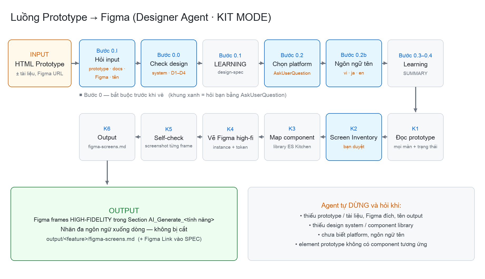
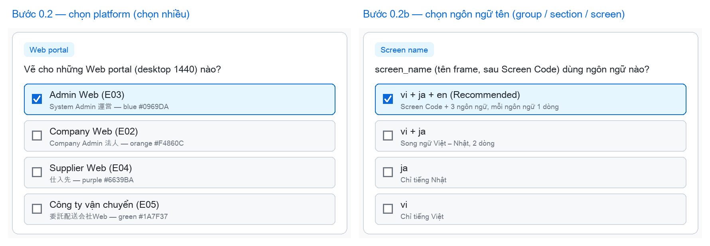
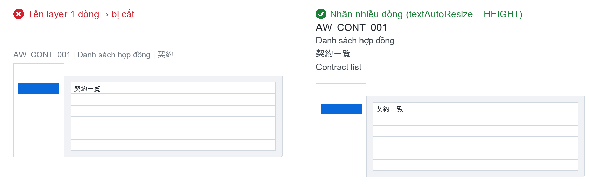
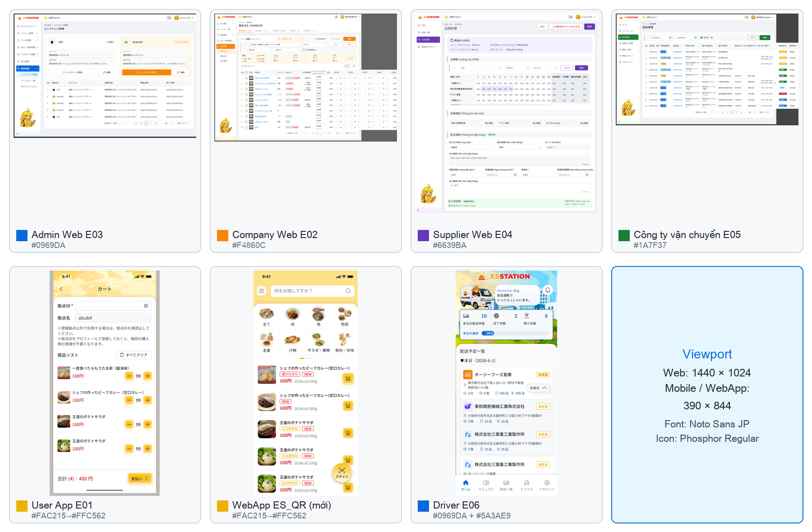

# Designer Kit — Prototype → Figma

Chuyển **HTML Prototype** thành **Figma high-fidelity** đúng design system ES Kitchen.



## 1. Kết nối Figma MCP (làm 1 lần)

Chọn **1** trong 2 cách:

- **A — Connector claude.ai (khuyến nghị):** trên claude.ai → *Settings → Connectors* → bật **Figma** → đăng nhập Figma. Mở Claude Code bằng cùng tài khoản là dùng được.
- **B — `.mcp.json` có sẵn trong kit:** bật `claude` tại folder này → gõ `/mcp` → chọn **figma** → **Authenticate** → Allow trên trình duyệt.

Kiểm tra: gõ `/mcp` → thấy **figma** ở trạng thái connected. Tài khoản Figma cần quyền **edit** file đích và dùng được library **ES Kitchen**.

## 2. Sử dụng

1. Copy prototype `.html` vào `input/`
2. Bật Claude tại folder kit:
   ```bash
   cd prototype-to-figma
   claude
   ```
3. Gọi agent:
   ```
   /prototype-to-figma input/<prototype>.html
   ```
   hoặc: `Hãy là Designer, chuyển prototype sang Figma: prototype: input/<prototype>.html`
4. Trả lời các hộp chọn — thiếu gì agent hỏi, không tự đoán:
   - **Input:** prototype ở đâu · tài liệu khác · Figma output ở đâu · tên output
   - **Platform:** Admin · Company · Supplier · Công ty vận chuyển · User App · ES_QR · Driver
   - **Ngôn ngữ tên** frame/section: đề xuất **vi + ja + en**

   

5. Duyệt danh sách màn → agent vẽ Figma → kết quả trong Figma + `output/<feature>/figma-screens.md`

## Lưu ý

- Màu, font, layout lấy từ design system ES Kitchen — không copy CSS của prototype.
- Tên đa ngôn ngữ được xuống dòng, không bị cắt chữ.
- Agent không sửa prototype, không commit/push.





📘 Hướng dẫn chi tiết có hình: `docs/HƯỚNG DẪN CÀI VÀ SỬ DỤNG PROTOTYPE TO FIGMA.docx`
