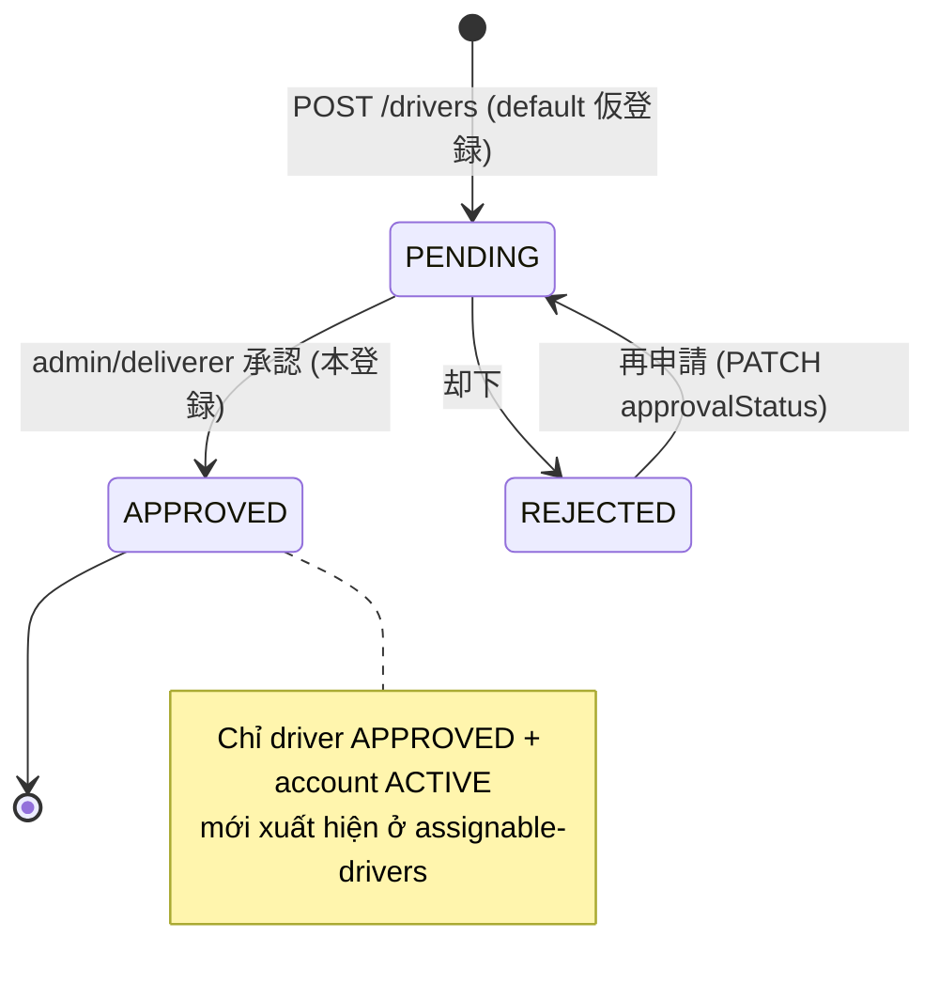
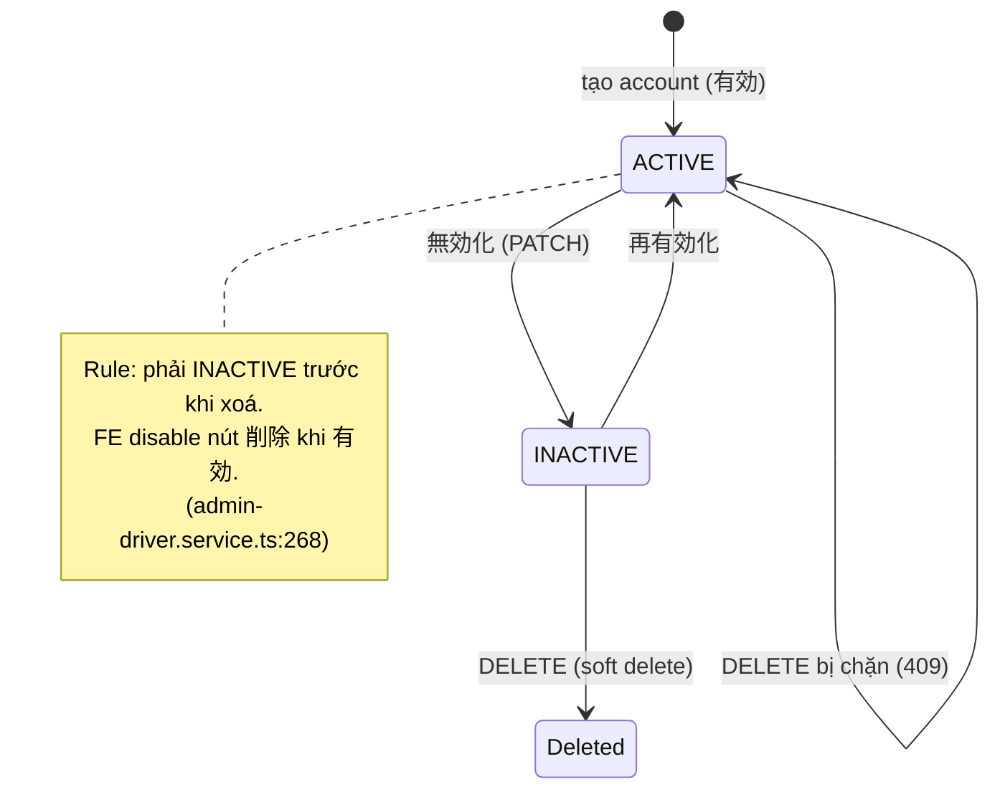
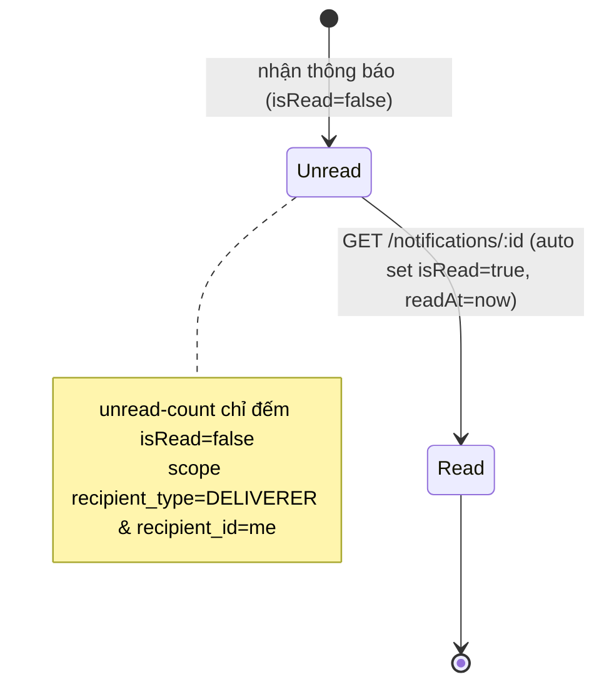
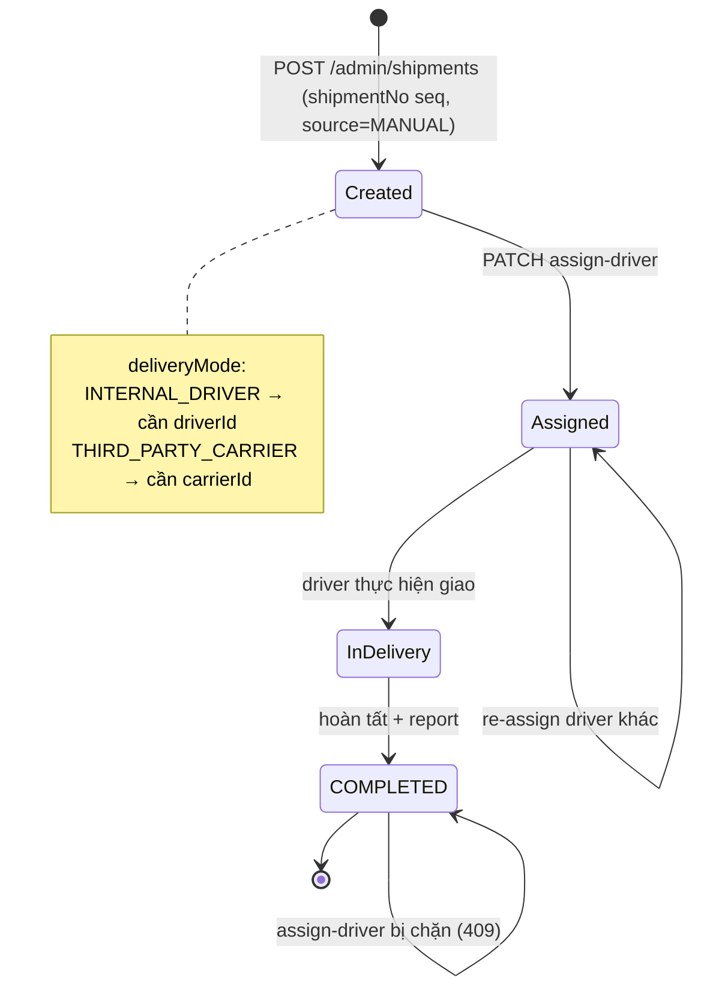

# 配送関連 (Deliverer / Shipment) — API Docs Index

> **Điểm vào (entry point) cho toàn bộ tài liệu 配送関連.** Đọc file này trước để nắm bản đồ tài liệu, danh mục endpoint đầy đủ, vòng đời trạng thái và yêu cầu phi chức năng (NFR). Chi tiết DTO / DB nằm ở các file con bên dưới.

---

## 1. Bản đồ tài liệu & thứ tự đọc

| # | File | Nội dung | Đọc khi |
|---|---|---|---|
| 1 | **README.md** (file này) | Index · danh mục endpoint · lifecycle · NFR | Bắt đầu / tra cứu nhanh |
| 2 | [`API設計_配送関連.md`](./API設計_配送関連.md) | Danh sách endpoint theo màn (Method/Path/UI) | Nắm scope API per màn |
| 3 | [`API仕様詳細_配送関連.md`](./API仕様詳細_配送関連.md) | DTO · validation · request/response JSON · enum | Khi implement BE/FE 1 endpoint cụ thể |
| 4 | [`DB変更提案_配送関連.md`](./DB変更提案_配送関連.md) | DB adequacy · gap (G1–G9) · quyết định nghiệp vụ · **Migration SQL (§6)** | Trước khi viết migration / sửa entity |
| 5 | HTML mockup (`OW_*`, `admin/MD*`, `admin/MP*`, `apis/**`) | Mockup màn + API wiring overlay | Khi dựng UI / map field UI↔API |

**Thứ tự BMAD:** mockup (SPEC) → `DB変更提案` (adequacy + gap) → `API設計` (endpoint) → `API仕様詳細` (DTO) → implement.

---

## 2. Danh mục Endpoint (API Catalog — toàn bộ)

> Tổng hợp 1 chỗ để tra cứu nhanh. Cột **Spec** trỏ tới section chi tiết trong `API仕様詳細_配送関連.md`.

### 2.1 Portal Deliverer — prefix `/deliverer`, `DelivererGuard` (ép `deliverer_id = me`)

| Method | Path | Màn | Permission | Spec |
|---|---|---|---|---|
| GET | `/deliverer/notifications` | OW_ANNO_001 | DelivererGuard | A1 |
| GET | `/deliverer/notifications/:id` | OW_ANNO_002 | DelivererGuard | A1 |
| GET | `/deliverer/notifications/unread-count` | (badge) | DelivererGuard | A1 |
| GET | `/deliverer/shipments` | OW_DLVR_001 | DelivererGuard | A2 |
| GET | `/deliverer/shipments/:id` | OW_DLVR_002 | DelivererGuard | A2 |
| GET | `/deliverer/shipments/:id/assignable-drivers` | OW_DLVR_002 | DelivererGuard | A2 |
| PATCH | `/deliverer/shipments/:id/assign-driver` | OW_DLVR_002 保存 | DelivererGuard | A2 |
| GET | `/deliverer/collection-reports` | OW_CLCT_001 | DelivererGuard | A3 |
| GET | `/deliverer/collection-reports/summary` | OW_CLCT_002 | DelivererGuard | A3 |
| GET | `/deliverer/collection-reports/:id` | OW_CLCT_002 | DelivererGuard | A3 |
| GET | `/deliverer/collection-reports/export` | CSVダウンロード | DelivererGuard | A3 |
| GET | `/deliverer/collection-reports/report` | レポート (.xlsx) | DelivererGuard | A3 |
| GET | `/deliverer/drivers` | OW_STAF_001 | DelivererGuard | A4 |
| GET | `/deliverer/drivers/:id` | OW_STAF_003 | DelivererGuard | A4 |
| POST | `/deliverer/drivers` | OW_STAF_004 | DelivererGuard | A4 |
| PATCH | `/deliverer/drivers/:id` | OW_STAF_003 編集 | DelivererGuard | A4 |
| DELETE | `/deliverer/drivers/:id` | OW_STAF_001/003 | DelivererGuard | A4 |
| POST | `/deliverer/drivers/:id/send-password` | パスワード送信 | DelivererGuard | A4 |

### 2.2 Admin — prefix `/admin`, `AdminGuard` + RBAC

| Method | Path | Màn | Permission | Spec |
|---|---|---|---|---|
| GET | `/admin/drivers` | MD01 | `driver.view` | B1 |
| GET | `/admin/drivers/:id` | MD02 基本情報 | `driver.view` | B1 |
| GET | `/admin/drivers/:id/history` | MD02 変更履歴 | `driver.view_history` | B1 |
| POST | `/admin/drivers` | MD02/STAF_004 | `driver.create` | B1 |
| PATCH | `/admin/drivers/:id` | MD02 編集 | `driver.update` | B1 |
| DELETE | `/admin/drivers/:id` | MD02 削除 | `driver.delete` | B1 |
| POST | `/admin/drivers/:id/send-password` | パスワード送信 | `driver.update` | B1 |
| GET | `/admin/shipments` | MP01 | `shipment.view` | B2 |
| POST | `/admin/shipments` | MP01 新規登録 | `shipment.create` | B2 |
| GET | `/admin/shipments/:id` | MP02 (7 khối) | `shipment.view` | B2 |
| PATCH | `/admin/shipments/:id` | MP02 編集 | `shipment.update` | B2 |
| DELETE | `/admin/shipments/:id` | MP02 削除 | `shipment.delete` | B2 |
| PATCH | `/admin/shipments/:id/assign-driver` | MP02 | `shipment.assign_driver` | B2 |

> **Tổng:** 18 endpoint Portal + 13 endpoint Admin = **31 endpoint**. RBAC keys → xem `API設計_配送関連.md` §C.

---

## 3. Vòng đời trạng thái (State Lifecycle)

> Bù cho điểm yếu "thiếu state diagram". Giá trị enum lấy từ `API仕様詳細_配送関連.md` §Enum và `database/db.dbml §ENUMS`.

### 3.1 Driver — 承認ステータス (`DriverApprovalStatus`)

### 3.2 Driver account — lifecycle xoá (`account.status`)

### 3.3 Notification — 既読状態 (`is_read`)

### 3.4 Shipment — luồng vận hành & 配送ステータス (`ShipmentStatus`)

> ⚠️ Giá trị đầy đủ của `ShipmentStatus` lấy từ `database/db.dbml §ENUMS` (tài liệu này chỉ minh hoạ luồng nghiệp vụ + state `COMPLETED` là terminal cho thao tác assign-driver). `COMPLETED` → assign-driver trả **409**.

---

## 4. Yêu cầu phi chức năng (NFR) & Performance

> Bù điểm yếu "thiếu performance/pagination/indexing notes". Đây là **khuyến nghị** ở mức thiết kế — index cụ thể chốt khi viết migration (xem `DB変更提案 §6`).

### 4.1 Phân trang (Pagination)
- Mọi list kế thừa `BaseSearchRequest`: `page` (default **1**), `limit` (default **10**), `order` (default **DESC**), `orderBy` (default **createdAt**).
- Response wrap: `{ items[], total, page, limit, totalPages }` qua `ApiUnifiedResponse`.
- **orderBy whitelist bắt buộc** (đã có bug prod) — chỉ cho phép cột nằm trong `ORDER_BY_MAP`, fallback `createdAt`.

### 4.2 Index khuyến nghị (bảng lớn)
| Bảng | Index đề xuất | Phục vụ query |
|---|---|---|
| `shipments` | `(deliverer_id, scheduled_send_date)` | Portal list scope me + filter 出荷予定日 |
| `shipments` | `(company_id)`, `(status)`, `(scheduled_delivery_date)` | filter 配送先 / status / 配送日 |
| `user_notifications` | `(recipient_type, recipient_id, is_read, created_at)` | list + unread-count (đã ghi ở D2) |
| `drivers` | `(deliverer_id, approval_status)` | list scope me + filter ステータス |
| `collection_reports` | `(driver_id, send_date)` | filter 配送スタッフ + 発送日 |

### 4.3 Ngày giờ & Encoding
- API trả ngày dạng **ISO 8601 (UTC)**; FE tự format hiển thị.
- Tổng hợp tháng (集計/レポート) theo **JST**.
- CSV export = **UTF-8 + BOM** (Excel JP đúng font; có thể đổi Shift_JIS theo KH).
- レポート 集金 = **Excel `.xlsx`** (lib `exceljs`).

### 4.4 Bảo mật / Scope
- Portal: `DelivererGuard` ép `deliverer_id = req.deliverer.id` ở **mọi** query; mọi `:id` kiểm tra thuộc về mình → **404** nếu không.
- Admin: `AdminGuard` + RBAC permission key per endpoint (§2.2).
- Mã lỗi chuẩn: **400** validation · **401** · **403** sai scope · **404** không thuộc về mình · **409** xung đột trạng thái.

---

## 5. Liên kết nhanh
- Endpoint per màn → [`API設計_配送関連.md`](./API設計_配送関連.md)
- DTO / JSON / validation → [`API仕様詳細_配送関連.md`](./API仕様詳細_配送関連.md)
- DB gap + Migration SQL → [`DB変更提案_配送関連.md`](./DB変更提案_配送関連.md)
- Mockup overview → [`index.html`](./index.html)
