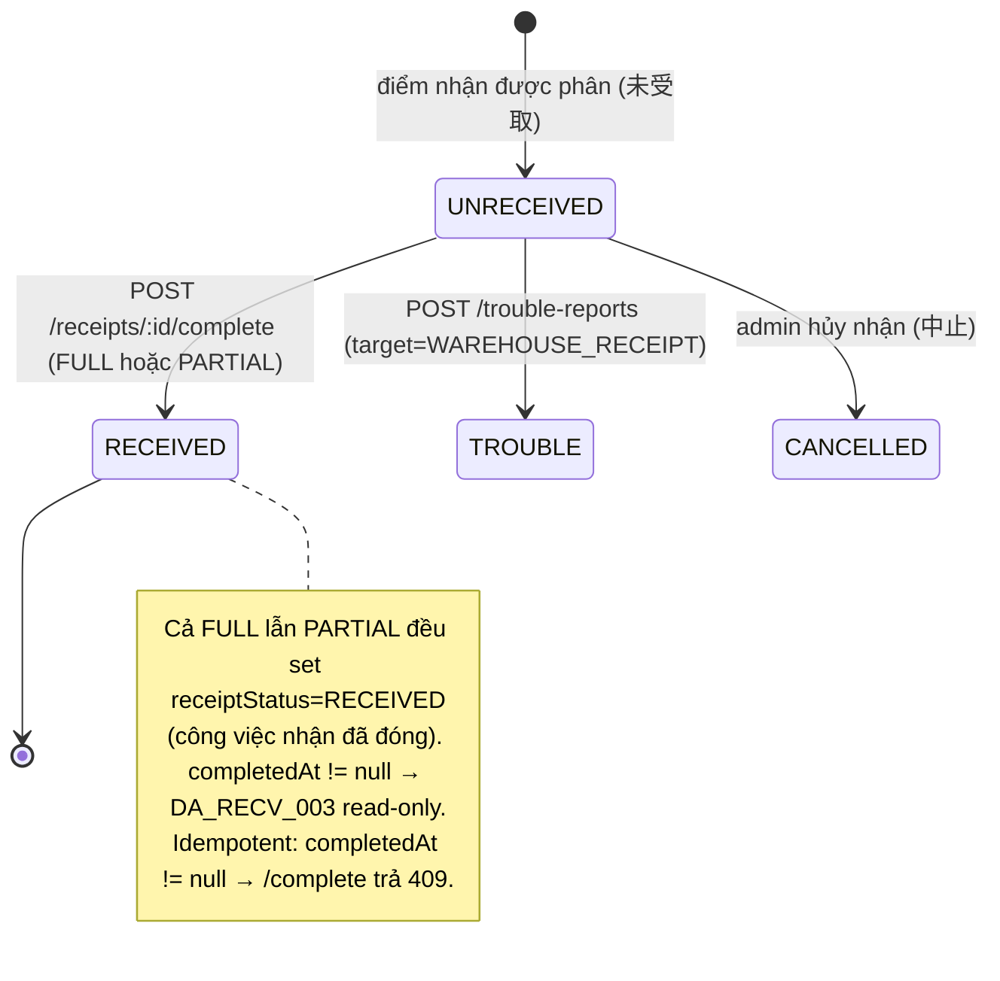
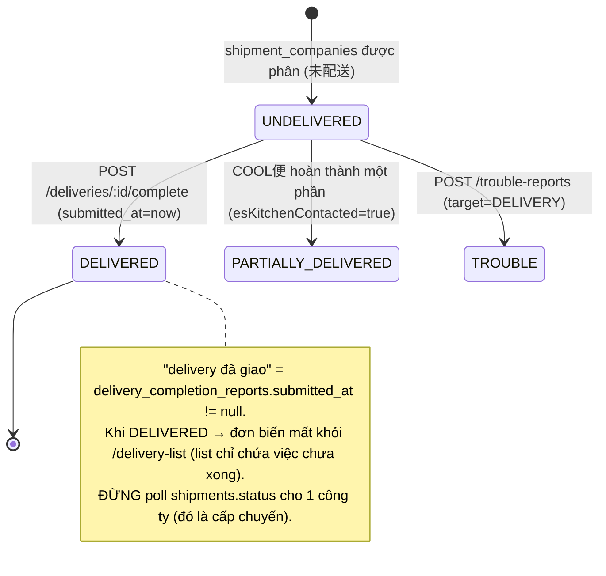
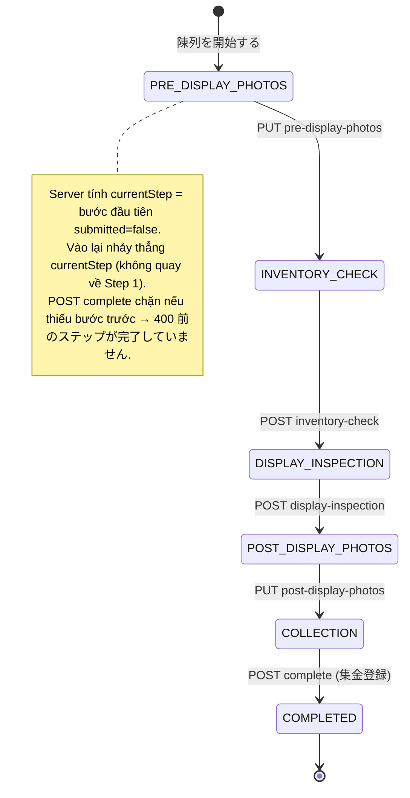
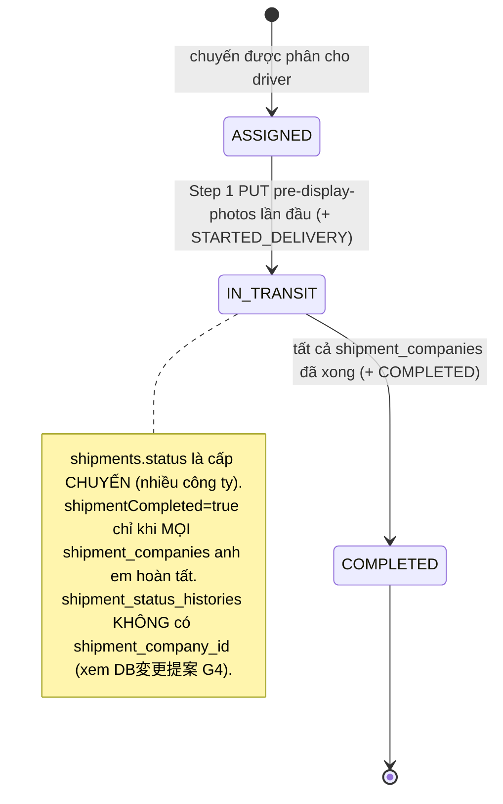
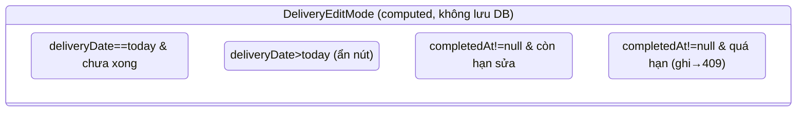
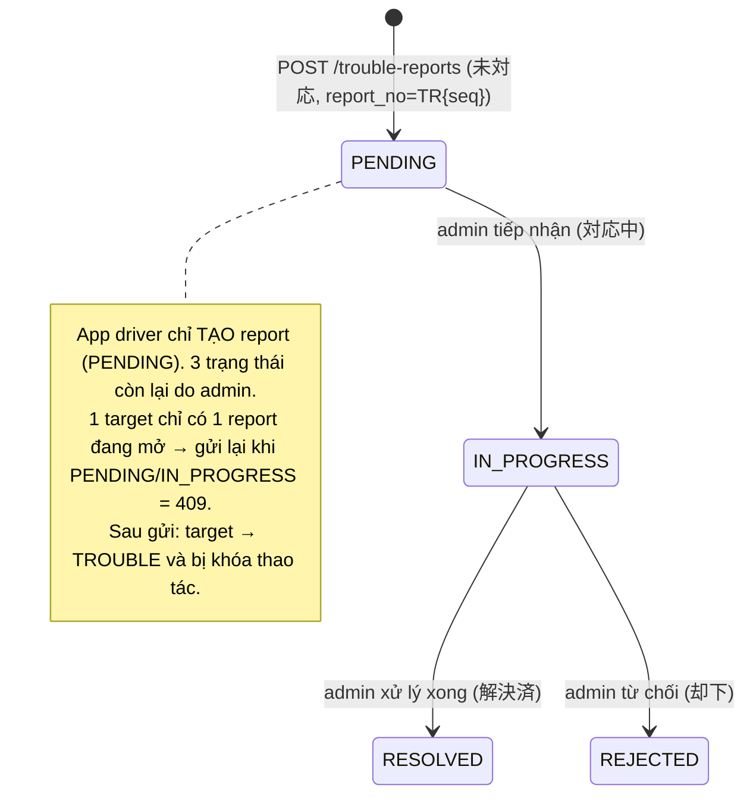

# ドライバーアプリ (Driver App / E06) — API Docs Index

> **Điểm vào (entry point) cho toàn bộ tài liệu App tài xế giao hàng (`es-kitchen-webapp-driver`, E06).** Đọc file này trước để nắm bản đồ tài liệu, danh mục endpoint đầy đủ, vòng đời trạng thái và yêu cầu phi chức năng (NFR). Chi tiết DTO / request / response của từng màn nằm ở các contract file trong [`apis/`](./apis/README.md).

> **Phạm vi:** App tài xế (`/driver`) — nhận hàng tại kho (倉庫受取), giao **ES配送便** (配送 + 棚入れ — wizard 5 bước) và **COOL便** (配送のみ — one-shot), báo cáo sự cố (トラブル報告). Auth qua **Driver Cognito pool**, list dùng **cursor pagination**. Đây là tài liệu mức **thiết kế (design)**, đối xứng với bộ tài liệu Deliverer (`../deliverer/`).

---

## 1. Bản đồ tài liệu & thứ tự đọc

| # | File | Nội dung | Đọc khi |
|---|---|---|---|
| 1 | **README.md** (file này) | Index · danh mục endpoint · lifecycle · NFR · error catalog | Bắt đầu / tra cứu nhanh |
| 2 | [`API設計_ドライバーアプリ.md`](./API設計_ドライバーアプリ.md) | Danh sách endpoint theo màn (Method/Path/UI) | Nắm scope API per màn |
| 3 | [`apis/README.md`](./apis/README.md) | Endpoint Index + Screen↔API map + **shared enums** | Tra cứu enum dùng chung / convention chung |
| 4 | [`apis/*.md`](./apis/) | **API仕様詳細** per feature: DTO · validation · request/response JSON · field mapping · business rules | Khi implement BE/FE 1 endpoint cụ thể |
| 5 | [`DB変更提案_ドライバーアプリ.md`](./DB変更提案_ドライバーアプリ.md) | DB adequacy · gap (G1–G9) · quyết định nghiệp vụ · Migration SQL đề xuất | Trước khi viết migration / sửa entity |
| 6 | HTML mockup (`dashboard/`, `delivery-list/`, `warehouse/`, `es-delivery/`, `cool-driver/`, `trouble-report/`) + `*/apis/index.html` | Mockup màn + API wiring overlay | Khi dựng UI / map field UI↔API |

**6 contract file chi tiết** (mức API仕様詳細):
[dashboard](./apis/dashboard.md) · [delivery-list](./apis/delivery-list.md) · [warehouse-receipt](./apis/warehouse-receipt.md) · [es-delivery](./apis/es-delivery.md) · [cool-delivery-completion](./apis/cool-delivery-completion.md) · [trouble-report](./apis/trouble-report.md)

**Thứ tự BMAD:** mockup (SPEC) → `DB変更提案` (adequacy + gap) → `API設計` (endpoint) → `apis/*.md` (DTO) → implement.

---

## 2. Danh mục Endpoint (API Catalog — toàn bộ)

> Tổng hợp 1 chỗ để tra cứu nhanh. Tất cả prefix `/driver`, **`DriverGuard`** (Bearer Driver Cognito; ép `shipments.driver_id = me`). Cột **Doc** trỏ tới contract file chi tiết.

| Method | Path | Màn | Doc |
|---|---|---|---|
| GET | `/driver/home` | DA_HOME_001 | [dashboard](./apis/dashboard.md) |
| GET | `/driver/schedules` | DA_HOME_001_Schedule / _Empty | [dashboard](./apis/dashboard.md) |
| GET | `/driver/delivery-list` | DA_LIST_00 (A/B/C) | [delivery-list](./apis/delivery-list.md) |
| GET | `/driver/receipts/:receiptId` | DA_RECV_001 / DA_RECV_003 | [warehouse-receipt](./apis/warehouse-receipt.md) |
| POST | `/driver/receipts/:receiptId/complete` | DA_RECV_001-02/03 | [warehouse-receipt](./apis/warehouse-receipt.md) |
| GET | `/driver/deliveries/:deliveryId` | DA_ESDL_000 / DA_COOL_001 | [es-delivery](./apis/es-delivery.md) · [cool](./apis/cool-delivery-completion.md) |
| PUT | `/driver/deliveries/:deliveryId/pre-display-photos` | DA_ESDL_001 (Step 1) | [es-delivery](./apis/es-delivery.md) |
| GET | `/driver/deliveries/:deliveryId/inventory-check` | DA_ESDL_002 (Step 2 load) | [es-delivery](./apis/es-delivery.md) |
| POST | `/driver/deliveries/:deliveryId/inventory-check` | DA_ESDL_002 (Step 2 submit) | [es-delivery](./apis/es-delivery.md) |
| GET | `/driver/deliveries/:deliveryId/display-inspection` | DA_ESDL_003 (Step 3 load) | [es-delivery](./apis/es-delivery.md) |
| POST | `/driver/deliveries/:deliveryId/display-inspection` | DA_ESDL_003 (Step 3 submit) | [es-delivery](./apis/es-delivery.md) |
| PUT | `/driver/deliveries/:deliveryId/post-display-photos` | DA_ESDL_004 (Step 4) | [es-delivery](./apis/es-delivery.md) |
| POST | `/driver/deliveries/:deliveryId/complete` | DA_ESDL_005 / DA_COOL_001-02 | [es-delivery](./apis/es-delivery.md) · [cool](./apis/cool-delivery-completion.md) |
| GET | `/driver/deliveries/:deliveryId/parking-report` | DA_ESDL_006-02 | [es-delivery](./apis/es-delivery.md) |
| PUT | `/driver/deliveries/:deliveryId/parking-report` | DA_ESDL_006-03 | [es-delivery](./apis/es-delivery.md) |
| GET | `/driver/trouble-reports/targets` | DA_RPTD_001 | [trouble-report](./apis/trouble-report.md) |
| POST | `/driver/trouble-reports` | DA_RPTD_002 | [trouble-report](./apis/trouble-report.md) |

> **Tổng: 17 endpoint** (`/driver`). Cộng 1 endpoint hạ tầng dùng chung **`POST /files/presigned-upload-url(s)`** cho upload ảnh (Step 1/4, 駐車報告, トラブル報告) — hiện gắn `AdminGuard`, **cần mở cho Driver pool** (xem [§4.5](#45-upload-ảnh-s3) + `DB変更提案 G8`).

### 2.1 Resource dùng chung `/driver/deliveries/:deliveryId`

`/driver/deliveries/:deliveryId` phục vụ **cả COOL và ES** — FE phân nhánh theo `shipmentType`. Mỗi `deliveryId` (= `shipment_companies.id`) chỉ thuộc **1 loại** nên `POST .../complete` không xung đột (body khác nhau theo loại giao):

| `shipmentType` | 日本語 | Luồng | `POST .../complete` body |
|---|---|---|---|
| `COOL` | COOL便 | One-shot — tick đủ kiện → 完了 | `{ boxes[], isPartiallyDelivered, esKitchenContacted }` |
| `ES_DELIVERY` | ES配送便 | Wizard 5 bước (配送 + 棚入れ) | `{ collectedAmount, companyRepName?, remarks? }` |

> Màn form トラブル報告 (`DA_RPTD_002`) **không có endpoint riêng**: tái dùng `GET /driver/deliveries/:id` hoặc `GET /driver/receipts/:id` để dựng box list; danh sách loại sự cố là **enum FE** (`TroubleReason`).

---

## 3. Vòng đời trạng thái (State Lifecycle)

> Bù điểm yếu "thiếu state diagram". Giá trị enum lấy từ [`apis/README.md › Shared enums`](./apis/README.md#-shared-enums-dùng-chung-nhiều-endpoint) và `database/db.dbml §ENUMS` (dòng 1674–1844).

### 3.1 Warehouse Receipt — 受取ステータス (`ReceiptStatus`, cấp điểm nhận)



### 3.2 Delivery — 配送ステータス (`DeliveryStatus`, cấp điểm giao = 1 công ty)



### 3.3 ES Delivery wizard — `WizardStep` + resume (`currentStep` / `lastCompletedStep`)



### 3.4 Shipment (chuyến) — `shipments.status` + `shipment_status_histories`



> Enum `ShipmentHistoryStatus`: `STARTED_DELIVERY` (Step 1) · `ARRIVED` (**chưa có trigger trong wizard** — G5) · `COMPLETED` (Step 5) · `REDELIVERY` / `NOT_DELIVERED` (ngoài luồng wizard).

### 3.5 editMode (computed) & Trouble report





> **TBD** — mốc khóa `LOCKED` ("編集可能：7日前まで") neo vào ngày nào (`scheduled_send_date` kỳ kế / `actual_delivery_date`?) phụ thuộc nguồn `nextDeliveryDate` (G2/G6).

---

## 4. Yêu cầu phi chức năng (NFR) & Performance

### 4.1 Auth & Scope
- Mọi request `/driver/**` cần `Authorization: Bearer <driver access token>` từ **Driver Cognito pool**.
- **`DriverGuard`** ép scope `shipments.driver_id = me`: mọi `:deliveryId` / `:receiptId` / target kiểm tra thuộc tài xế đang đăng nhập → **404/403** nếu không (xem [§5 Error catalog](#5-error-catalog)).
- Danh tính tài xế lấy từ **Bearer token** — **không** nhận `driverId` trong body.

### 4.2 Phân trang (Cursor-based — infinite scroll)
- Chỉ áp dụng cho list: `GET /driver/delivery-list`, `GET /driver/trouble-reports/targets`. Detail / completion flow **không** paginate.
- Query: `cursor` (lấy từ `nextCursor` của response trước) + `limit` (default **20**, tối đa **50**).
- Response kèm `nextCursor` (`null` khi hết) + `hasMore`.
- `delivery-list`: span ngày `startDate..endDate` ≤ **31 ngày**; sort `deliveryDate ASC → status priority (TROUBLE > UNRECEIVED/UNDELIVERED > RECEIVED) → name ASC`.

### 4.3 i18n & Ngày giờ
- `Accept-Language: ja | vi` (default `ja`); server trả **chuỗi đã dịch** (nestjs-i18n) cho `message` và các option.
- API trả ngày **ISO 8601** kèm timezone (+09:00); field date-only dùng `yyyy-MM-dd`. FE tự format hiển thị `（曜日）`.

### 4.4 Index khuyến nghị (bảng lớn)
> Khuyến nghị mức thiết kế — index cụ thể chốt khi viết migration (xem `DB変更提案`).

| Bảng | Index đề xuất | Phục vụ query |
|---|---|---|
| `shipments` | `(driver_id, scheduled_send_date)` | scope me + filter ngày list/home/schedules |
| `shipments` | `(status)` | lifecycle chuyến |
| `shipment_companies` | `(shipment_id)`, `(company_id)` | gom theo chuyến / công ty |
| `delivery_completion_reports` | `(shipment_company_id)` unique, `(submitted_at)` | suy `deliveryStatus=DELIVERED` + tab tổng kết |
| `shipment_cargo_boxes` | `(shipment_company_id, inspection_status)` | tick nhận/kiểm phẩm |
| `trouble_reports` | `(shipment_id, status)` | chặn report trùng (1 target 1 report mở) |
| `trouble_report_items` | `(trouble_report_id)` | snapshot kiện bị ảnh hưởng |

### 4.5 Upload ảnh (S3)
- Các bước ảnh (Step 1/4), biên lai gửi xe (駐車報告), ảnh sự cố (トラブル報告) **không** upload binary trực tiếp vào endpoint bước — FE đẩy file lên S3 trước qua module upload, rồi submit **mảng `fileUrl`**:
  1. `POST /files/presigned-upload-urls` → `{ key, uploadUrl, fileUrl, expiresIn }` mỗi ảnh
  2. Client `PUT` binary → `uploadUrl` (S3)
  3. Submit `{ photoUrls: [fileUrl, ...] }` vào endpoint bước
- Giới hạn **1–5 ảnh** mỗi bước (`photoMax = 5`, hằng số FE).
- ⚠️ **TBD (G8):** `/files/*` hiện gắn `AdminGuard` — cần mở cho Driver Cognito pool (hoặc thêm biến thể `/driver/uploads/*` cùng pattern presigned) **trước khi triển khai**.

### 4.6 Thành phần chỉ-FE (không sinh request)
- Filter client-side: 「未確認のみ表示」, ô tìm 「名前/コードで検索」, 「納品先拠点名」, scan barcode (so khớp `boxes[].barcode`).
- Số điện thoại khẩn `supportPhoneNumber = 050-5784-2777` (hằng số FE).
- Banner COOL便 「冷蔵便です。温度管理に注意して配送してください。」; thanh tiến trình 5 bước; popup xác nhận chênh lệch Step 3; popup 破棄 khi back.

---

## 5. Error catalog

> Envelope **theo backend thật** (global exception filter). `statusCode` là **enum chuỗi**, KHÔNG phải HTTP number; mã nghiệp vụ (nếu có) ở `errorCode`.

```json
{ "statusCode": "error", "message": "…", "title": "Bad Request", "errorCode": null, "data": null }
```

- Success: `{ "statusCode": "success", "message": "…", "data": <T> }`.
- Validation fail (class-validator): `{ "statusCode": "validaton_error", "message": "Input validation failed", "data": ["…field msg…"] }` (giữ nguyên typo `validaton_error` của code).
- `statusCode` values: `success` · `error` · `unauthorized` · `forbidden` · `not_found` · `conflict` · `validaton_error` · `internal_error`.
- Map HTTP → `statusCode`: 400→`error`/`validaton_error` · 401→`unauthorized` · 403→`forbidden` · 404→`not_found` · 409→`conflict`.

| HTTP | `statusCode` | Tình huống tiêu biểu | `errorCode` (nếu có) |
|---|---|---|---|
| 400 | `error` | `receivedItemIds`/`boxes` rỗng · thiếu bước trước (wizard) · partial nhưng `esKitchenContacted=false` · ảnh > 5 · `startDate>endDate` · span > 31 ngày | `DRIVER_4001` (COOL thiếu kiện) · `DRIVER_4002` (partial thiếu liên hệ ES) |
| 401 | `unauthorized` | Token sai / hết hạn | — |
| 403 | `forbidden` | Receipt/Delivery không phân cho tài xế hiện tại | `DRIVER_4031` |
| 404 | `not_found` | `receiptId`/`deliveryId`/`targetId` không tồn tại hoặc không thuộc me | `DRIVER_4041` |
| 409 | `conflict` | Điểm nhận/giao đã hoàn thành (idempotent guard) · target đã có report đang mở | — |

---

## 6. Liên kết nhanh
- Endpoint per màn → [`API設計_ドライバーアプリ.md`](./API設計_ドライバーアプリ.md)
- DTO / JSON / validation / business rules → [`apis/`](./apis/README.md) (6 contract file)
- DB adequacy + gap + Migration SQL → [`DB変更提案_ドライバーアプリ.md`](./DB変更提案_ドライバーアプリ.md)
- Mockup wiring (click số → field/endpoint): [ホーム](./dashboard/apis/index.html) · [配送一覧](./delivery-list/apis/index.html) · [荷物受取](./warehouse/apis/index.html) · [ES配送便](./es-delivery/apis/index.html) · [COOL便](./cool-driver/apis/index.html) · [トラブル報告](./trouble-report/apis/index.html)
