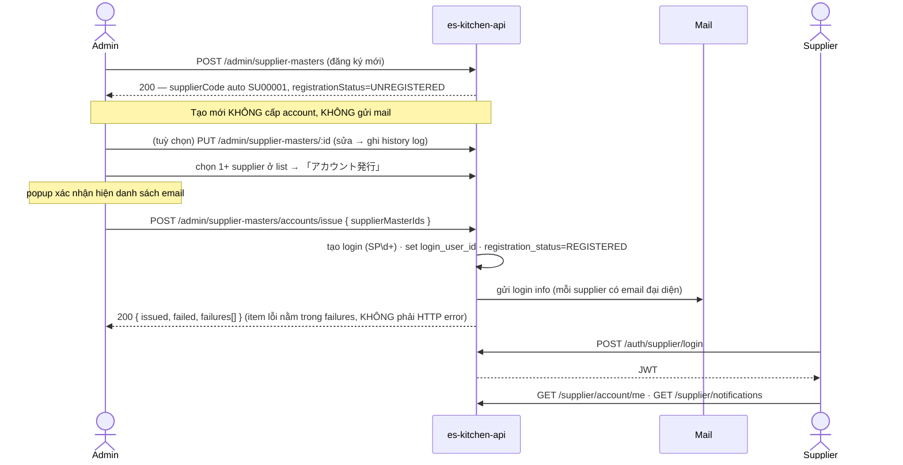
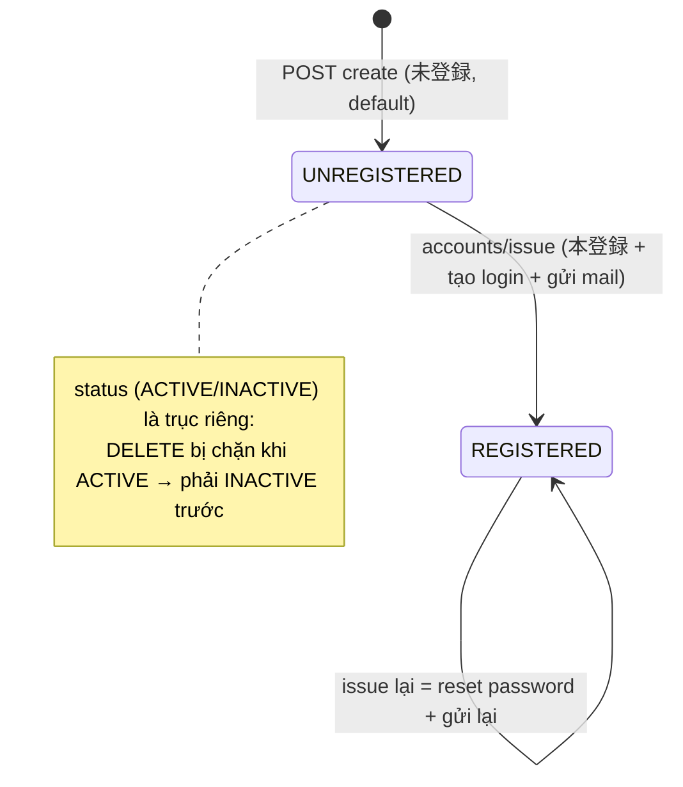
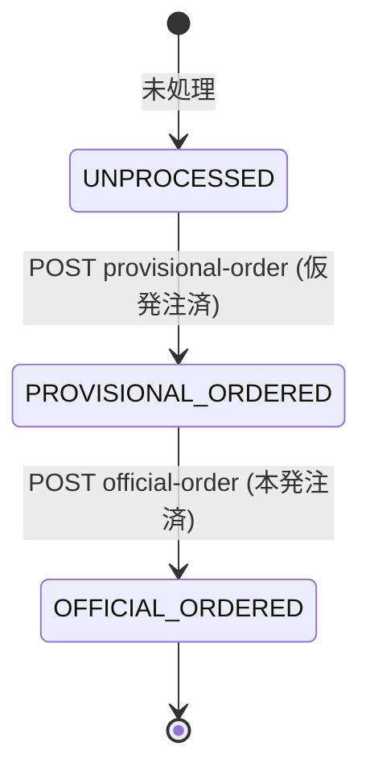

# 仕入先 (Supplier) — API Docs Index

> **Điểm vào (entry point) cho toàn bộ tài liệu Supplier.** Đọc file này trước để nắm bản đồ tài liệu, danh mục endpoint, **blockers tổng hợp**, luồng end-to-end và vòng đời trạng thái. Chi tiết DTO/DB nằm ở 2 file con bên dưới.

---

## 1. Bản đồ tài liệu & thứ tự đọc

| # | File | Nội dung | Đọc khi |
|---|---|---|---|
| 1 | **README.md** (file này) | Index · catalog · blockers · happy-path · lifecycle | Bắt đầu / tra cứu nhanh |
| 2 | [`SUPPLIER_DB_API_DESIGN.md`](./SUPPLIER_DB_API_DESIGN.md) | Decision Log · DB change report · API design · **Migration SQL (PART 1.8)** | Thiết kế DB / viết migration |
| 3 | [`SUPPLIER_API_CONTRACT.md`](./SUPPLIER_API_CONTRACT.md) | Contract FE: request/response TS · validation · error codes · i18n | FE implement màn |
| 4 | HTML mockup (`admin-management/**`, `apis/**`, `DA_*`) | Mockup + API wiring overlay | Dựng UI / map field UI↔API |

**Thứ tự BMAD:** mockup (SPEC) → `SUPPLIER_DB_API_DESIGN` (Decision Log + DB + API design) → `SUPPLIER_API_CONTRACT` (contract FE) → implement.

---

## 2. Danh mục Endpoint (API Catalog — toàn bộ)

### 2.1 Admin — 仕入先マスタ · prefix `/admin/supplier-masters` (Admin JWT + RBAC)

| Method | Path | Màn | Permission | Trạng thái |
|---|---|---|---|---|
| GET | `/admin/supplier-masters` | 仕入先マスタ list | `supplier_master.read` | ✅ Batch 1 |
| GET | `/admin/supplier-masters/:id` | 基本情報 | `supplier_master.read` | ✅ Batch 1 |
| POST | `/admin/supplier-masters` | 仕入先情報登録 | `supplier_master.create` | ✅ Batch 1 |
| PUT | `/admin/supplier-masters/:id` | 仕入先情報編集 | `supplier_master.update` | ✅ Batch 1 |
| DELETE | `/admin/supplier-masters/:id` | 削除 (soft) | `supplier_master.delete` | ✅ Batch 1 |
| GET | `/admin/supplier-masters/:id/history` | 変更履歴 | `supplier_master.read` | ✅ Batch 1 |
| POST | `/admin/supplier-masters/accounts/issue` | アカウント発行 | `supplier_account.issue` | ✅ Batch 1 |
| GET | `/admin/supplier-masters/export` | CSV出力 | `supplier_master.export` | ⏳ chờ template (D2-1) |
| POST | `/admin/supplier-masters/import` | CSV取込 | `supplier_master.import` | ⏳ chờ template (D2-1) |

### 2.2 Supplier self-service · prefix `/supplier` (Supplier JWT)

| Method | Path | Màn | Trạng thái |
|---|---|---|---|
| GET | `/supplier/account/me` | (tài khoản) | ✅ đã tồn tại |
| POST | `/supplier/account/change-password` | パスワード変更 | ✅ đã tồn tại |
| GET | `/supplier/notifications` | お知らせ (DA_HOME_001) | ⚠️ design — chốt nhãn 重要/お知らせ |
| PATCH | `/supplier/notifications/:id/read` | お知らせ | ⚠️ design |
| GET | `/supplier/orders` | 注文管理 (DA_注文管理) | ⛔ TBD — #B' entity backing |
| GET | `/supplier/orders/:id` | 注文詳細編集 (DA_注文詳細編集) | ⚠️ design — #C' 論理必要数/在庫数 |
| POST | `/supplier/orders/:id/provisional-order` | 仮発注 | ⚠️ design (chưa migrate) |
| POST | `/supplier/orders/:id/official-order` | 本発注 | ⚠️ design (chưa migrate) |
| POST | `/supplier/orders/:id/import` | CSV取込 | ⏳ chờ template |
| PUT | `/supplier/order-details/:detailId` | sửa dòng | ⚠️ design |
| DELETE | `/supplier/order-details/:detailId` | xoá mềm dòng | ⚠️ design |

### 2.3 Auth (đã tồn tại — không implement lại)
`POST /auth/supplier/login` · `.../forgot-password/{request,verify-otp,reset-password}` · `.../logout`.

> **Chú giải trạng thái:** ✅ = implement ngay · ⚠️ design = đã ký API nhưng chờ chốt 1 điểm · ⛔ TBD = **không** connect API thật (chỉ mock UI) · ⏳ = chờ template/encoding. **出荷処理 (DA_出荷処理) — NGOÀI SCOPE** (BA chốt không làm).

---

## 3. Blockers tổng hợp (Single Tracker) 🔴

> Bù điểm yếu "TBD bị phân mảnh". Gom **mọi** điểm chờ chốt từ cả 2 file vào 1 bảng — đây là checklist chặn duy nhất.

| ID | Vấn đề | Chặn màn / field | Owner | Priority | Status |
|---|---|---|---|---|---|
| **A4-1** | Giá trị thực `仕入れ先区分` (enum đang placeholder `CLASS_1/CLASS_2`) | dropdown 区分 · filter | BA | 🔴 HIGH | OPEN |
| **#B'** | Entity backing 注文管理: nguồn `合計金額` + enum status (未処理/仮注文/正式注文/確認済み) | toàn màn 注文管理 | BA | 🔴 HIGH | OPEN |
| **#C'** | 論理必要数 / 在庫数 chưa có nguồn DB (không có bảng forecast/stock) | 2 cột 注文詳細編集 | BA | 🔴 HIGH | OPEN |
| **D1** | Nhãn 重要/お知らせ: `notifications.type` value vs cờ `is_important` | filter tab お知らせ | BA | 🟡 MED | OPEN |
| **D2-1** | Bộ cột CSV + encoding (Shift_JIS/UTF-8) + match rule 仕入先マスタ | CSV 取込/出力 | BA | 🟡 MED | OPEN |
| **A1-1** | 1 supplier có bắt buộc ≥1 địa chỉ `本社`? | cột 本社住所 ở list | BA | 🟢 LOW | OPEN |
| **A3** ⚠️ | PUT **replace toàn bộ** addresses/contacts — FE gửi thiếu = mất data | màn 編集 | Backend+FE | 🟡 MED | ASSUMPTION |
| **A4** ℹ️ | Batch issue trả HTTP 200 kể cả có `failures` | popup kết quả 発行 | Backend | 🟢 LOW | ASSUMPTION |

> **Quy tắc:** màn ⛔ TBD (注文管理) **không** connect API thật cho tới khi #B' đóng. Màn ✅ Batch 1 **không** bị blocker nào chặn → implement ngay.

---

## 4. Luồng end-to-end (Happy Path) — Supplier Master → Account → Login

> Bù điểm yếu "thiếu narrative end-to-end". Đây là happy-path xuyên suốt Batch 1.

**Các nhánh lỗi cần xử lý:**
- Email đại diện thiếu khi 発行 → item vào `failures` với `EMAIL_MISSING` (không chặn batch).
- Supplier đã có account khi 発行 lại → **reset password + gửi lại** (cảnh báo "既存アカウントがある場合、パスワードがリセットされます" hiển thị ở popup khi dòng chọn đang `REGISTERED`).
- DELETE supplier đang `ACTIVE` → **400** `SUPPLIER_MASTER_ACTIVE_CANNOT_DELETE` (phải INACTIVE trước).

---

## 5. Vòng đời trạng thái (State Lifecycle)

### 5.1 仕入先マスタ — `registration_status` (tách biệt với `status` lifecycle)

### 5.2 注文詳細編集 — dòng đơn `line_status` (⚠️ design, chưa migrate)

> `line_status` thuộc PART 3 (**đề xuất DBML — chưa migration**). Không migrate cho tới khi 注文管理/注文詳細 được BA chốt entity backing (#B'/#C').

---

## 6. Liên kết nhanh
- DB design + Migration SQL → [`SUPPLIER_DB_API_DESIGN.md`](./SUPPLIER_DB_API_DESIGN.md)
- Contract FE (TS interfaces, error codes, i18n) → [`SUPPLIER_API_CONTRACT.md`](./SUPPLIER_API_CONTRACT.md)
- Checklist trước khi FE implement → [`SUPPLIER_API_CONTRACT.md` §10](./SUPPLIER_API_CONTRACT.md#10-checklist-trước-khi-fe-implement)
- Mockup overview → [`index.html`](./index.html)
