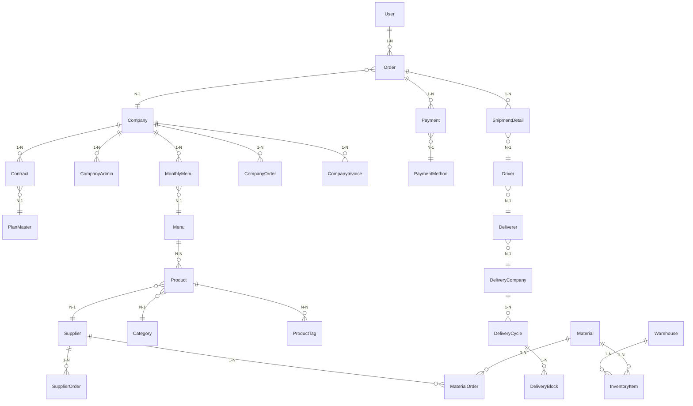

# es-kitchen-api — Entity Relationship Overview

> Tổng hợp entity landscape từ source code thực tế (`src/entities/*.entity.ts`).
> **159 entities**, PostgreSQL, TypeORM 0.3.28.
> PK convention: `bigint` (trả về dạng `string` trong TypeScript response).

> **Note:** Full mermaid ERD với tất cả 159 entity không thực tế để maintain. File này liệt kê **cluster + relation quan trọng**. Chi tiết column/index của entity cụ thể → đọc trực tiếp `src/entities/<name>.entity.ts` (single source of truth).

---

## Cluster 1 — Identity & Auth

| Entity | Path | Vai trò |
|---|---|---|
| `UserEntity` | `src/entities/user.entity.ts` | End-user (E01, E07) |
| `AdminEntity` | `src/entities/admin.entity.ts` | System admin (E03) |
| `CompanyAdminEntity` | `src/entities/company-admin.entity.ts` | Company admin (E02) |
| `PendingUserEntity` | `src/entities/pending-user.entity.ts` | Registration flow buffer |
| `AuthSessionEntity` | `src/entities/auth-session.entity.ts` | Session tracking / device management |
| `RoleEntity` | `src/entities/role.entity.ts` | RBAC role |
| `PermissionEntity` | `src/entities/permission.entity.ts` | RBAC permission |

**Quan hệ chính:**

- `UserEntity` — `AuthSessionEntity` (1-N)
- `AdminEntity` — `RoleEntity` (N-1) — `PermissionEntity` (N-N qua join table)
- `CompanyAdminEntity` — `CompanyEntity` (N-1)

---

## Cluster 2 — Business core (Company / Contract / Menu / Product)

| Entity | Vai trò |
|---|---|
| `CompanyEntity` | Enterprise client — root aggregate cho E02 |
| `ContractEntity` | Hợp đồng company ↔ ESKITCHEN |
| `MenuEntity` | Menu master (config + monthly) |
| `MonthlyMenuEntity` | Menu theo tháng cho company |
| `ProductEntity` | Product catalog |
| `ProductTagEntity` | Tag/label cho product (dinh dưỡng, allergen, …) |
| `CategoryEntity` | Product category |
| `SupplierEntity` | Supplier master |
| `PlanMasterEntity` | Service plan tier |
| `ServiceOptionEntity` | Optional add-on per plan |

**Quan hệ chính:**

- `CompanyEntity` — `ContractEntity` (1-N) — `PlanMasterEntity` (N-1)
- `MonthlyMenuEntity` — `CompanyEntity` (N-1) — `MenuEntity` (N-1)
- `MenuEntity` — `ProductEntity` (N-N qua join)
- `ProductEntity` — `SupplierEntity` (N-1) — `CategoryEntity` (N-1)
- `ProductEntity` — `ProductTagEntity` (N-N)

---

## Cluster 3 — Delivery & Logistics

| Entity | Vai trò |
|---|---|
| `DeliveryCompanyEntity` | Carrier (dùng chung E05/E06) |
| `DelivererEntity` | Delivery partner (E05) |
| `DriverEntity` | Driver (E06) |
| `DeliveryCycleEntity` | Chu kỳ giao hàng |
| `DeliveryBlockEntity` | Khối giao hàng (thứ + slot) |
| `DeliveryAddressEntity` | Địa chỉ giao |
| `ShipmentDetailEntity` | Chi tiết một chuyến giao |
| `RelayDestinationEntity` | Điểm trung chuyển |
| `WarehouseEntity` | Kho |
| `PickingCalendarEntity` | Lịch picking |
| `PickingUnavailableDayEntity` | Ngày không picking |
| `SpecialDeliveryRuleEntity` | Rule đặc biệt (holiday, …) |

**Quan hệ chính:**

- `DelivererEntity` — `DriverEntity` (1-N)
- `DeliveryCompanyEntity` — `DeliveryCycleEntity` (1-N) — `DeliveryBlockEntity` (1-N)
- `ShipmentDetailEntity` — `OrderEntity` (N-1) — `DriverEntity` (N-1) — `DeliveryAddressEntity` (N-1)

---

## Cluster 4 — Ordering & Payment

| Entity | Vai trò |
|---|---|
| `OrderEntity` | End-user order (E01, E07) |
| `CompanyOrderEntity` | Corporate order (E02 → aggregated) |
| `SupplierOrderEntity` | Purchase order gửi Supplier (E04) |
| `MaterialOrderEntity` | Material/ingredient PO |
| `PaymentEntity` | Payment record |
| `PaymentMethodEntity` | Method master (credit card, bank transfer, …) |
| `RefundEntity` | Refund request |
| `CompanyInvoiceEntity` | Invoice cho company |
| `BillOneApiLogEntity` | Billing API integration log |

**Quan hệ chính:**

- `OrderEntity` — `UserEntity` (N-1) — `CompanyEntity` (N-1) — `PaymentEntity` (1-N)
- `PaymentEntity` — `PaymentMethodEntity` (N-1)
- `CompanyOrderEntity` — `CompanyEntity` (N-1) — `MonthlyMenuEntity` (N-1)
- `CompanyOrderEntity` — `CompanyInvoiceEntity` (N-1)
- `SupplierOrderEntity` — `SupplierEntity` (N-1)

---

## Cluster 5 — Inventory & Material

| Entity | Vai trò |
|---|---|
| `MaterialEntity` | Material master (ingredient) |
| `InventoryItemEntity` | Stock tracking |
| `MaterialOrderEntity` | PO cho material |
| `DisposalReportEntity` | Waste/disposal report |

**Quan hệ chính:**

- `InventoryItemEntity` — `MaterialEntity` (N-1) — `WarehouseEntity` (N-1)
- `MaterialOrderEntity` — `MaterialEntity` (N-1) — `SupplierEntity` (N-1)
- `DisposalReportEntity` — `CompanyEntity` (N-1)

---

## Cluster 6 — Workflow / Request

| Entity | Vai trò |
|---|---|
| `ChangeRequestEntity` | Request đổi contract/menu (workflow duyệt) |
| `QuotationRequestEntity` | Request báo giá (deliverer) |
| `TroubleReportEntity` | Báo cáo sự cố (driver, admin) |
| `TrialRequestEntity` | Trial company registration |
| `FeeChangeRequestEntity` | Deliverer fee update request |
| `DeliveryDateChangeRequestEntity` | User request đổi ngày giao |

---

## Cluster 7 — AI / Suggestion

| Entity | Vai trò |
|---|---|
| `AiSuggestionJobEntity` | Job queue (async processing) |
| `AiSuggestionChatEntity` | Chat history với AI |
| `CompanyAiPreferenceEntity` | AI setting per company |

---

## Cluster 8 — Reference / Notification

| Entity | Vai trò |
|---|---|
| `NotificationEntity` | System notification (push + in-app) |
| `MaintainSettingEntity` | Bảo trì system-wide |
| `AppVersionEntity` | Version gate cho mobile/web |
| `IpWhitelistEntity` | IP whitelist cho admin panel |
| `SurveyEntity` | Survey master |
| `FeedbackEntity` | User feedback |

---

## Convention chung

### Primary key

- Type: `bigint` (`@PrimaryGeneratedColumn('increment', { type: 'bigint' })`)
- Serialize sang `string` khi trả response (do JS `Number` không đủ range cho `bigint`)
- BigInt validation qua `BigIntValidationPipe` khi nhận input

### Timestamp

- `created_at`, `updated_at` mọi entity (base class `BaseEntity` trong `src/commons/framework/`)
- `deleted_at` cho soft delete (dùng `@DeleteDateColumn`)

### Naming

- **Column:** `snake_case` với `@Column({ name: 'company_code' })`
- **Property:** `camelCase`
- **Table:** `snake_case` số nhiều (`companies`, `menu_items`)

### Relation

- Default `eager: false` — tránh N+1
- `@JoinColumn({ name: 'company_id' })` để explicit tên FK column

---

## Diagram (mermaid — 6 cluster tổng thể)

---

## Migration reference

- **Path:** `database/migrations/`
- **Count:** 205 files
- **Convention:** `<epoch>-<PascalCase>.ts`
- **Sync mode:** OFF (migration-only, không dùng `synchronize: true` bất kỳ môi trường nào)

Khi thêm entity mới → tạo migration mới, đừng sửa migration cũ.

---

## Memory Update Gate

Khi thêm/đổi column, thêm/đổi relation, thêm entity mới → **cập nhật cluster tương ứng** trong file này (thêm dòng vào bảng + note relation). Với entity thêm mới hoàn toàn không thuộc cluster nào → tạo cluster mới.
