# es-kitchen-api — Entity Relationship Diagram

> Tổng hợp từ source code thực tế (`src/entities/*.entity.ts`).  
> 66 entities, PostgreSQL, TypeORM. PK là `bigint` (trả về dạng `string` trong TypeScript).

---

## Diagram tổng thể (Mermaid)

```mermaid
erDiagram
    %% ── Company Domain ──────────────────────────────────
    companies ||--o{ company_contracts : "contracts"
    companies ||--o{ company_admins : "admins"
    companies ||--o{ users : "users (nullable)"
    companies ||--o{ company_history_logs : "historyLogs"

    company_contracts ||--o{ contract_equipments : "equipments"
    company_contracts ||--o{ contract_payment_items : "paymentItems"
    company_contracts ||--o{ contract_history_logs : "historyLogs"

    %% ── User Domain ─────────────────────────────────────
    users }o--|| payment_methods : "defaultPaymentMethod (nullable)"
    users ||--o{ user_devices : "devices"
    users ||--o{ user_favorites : "favorites"
    users ||--o{ user_notifications : "notifications"
    users ||--o| carts : "cart (unique)"
    users ||--o{ orders : "orders (SET NULL on delete)"
    users ||--o{ user_company_history : "companyHistory"
    users ||--o{ user_company_restrictions : "restrictions"
    users ||--o| elepay_customers : "elepayCustomer"

    %% ── Menu & Product Domain ───────────────────────────
    menus ||--o{ menu_products : "menuProducts"
    menus ||--o{ menu_histories : "histories"
    products ||--o{ menu_products : "menuProducts"
    products ||--o{ product_suppliers : "suppliers"
    products ||--o{ product_images : "images"
    products ||--o{ product_history : "history"
    products ||--o{ user_favorites : "favoritedBy"
    products ||--o{ cart_items : "cartItems"
    products ||--o{ order_details : "orderDetails (nullable)"

    %% ── Order & Payment Domain ──────────────────────────
    orders ||--o{ order_details : "orderDetails (CASCADE)"
    orders ||--|| payments : "payment (CASCADE)"
    orders }o--|| payment_methods : "paymentMethod (RESTRICT)"
    payments }o--|| payment_methods : "paymentMethod (RESTRICT)"

    %% ── Company Monthly Order Domain ────────────────────
    companies ||--o{ company_orders : "monthlyOrders"
    company_orders ||--o{ company_order_items : "items"
    company_orders ||--o{ company_order_delivery_slots : "deliverySlots"
    company_order_items ||--o{ company_order_item_delivery_quantities : "deliveryQuantities"
    company_order_delivery_slots ||--o{ company_order_item_delivery_quantities : "itemQuantities"

    %% ── Material Order Domain ───────────────────────────
    companies ||--o{ material_orders : "materialOrders"
    material_orders ||--o{ material_order_items : "items"
    material_orders ||--o{ material_deliveries : "deliveries"
    materials ||--o{ material_order_items : "orderItems"

    %% ── Supplier Domain ─────────────────────────────────
    suppliers ||--o{ supplier_addresses : "addresses"
    suppliers ||--o{ supplier_contacts : "contacts"
    suppliers ||--o{ supplier_history_logs : "historyLogs"
    suppliers ||--o{ supplier_orders : "orders"
    supplier_orders ||--o{ supplier_order_details : "details"
    supplier_orders ||--o{ supplier_order_material_details : "materialDetails"

    %% ── Cart Domain ─────────────────────────────────────
    carts ||--o{ cart_items : "items (CASCADE)"
    cart_items }o--|| products : "product (CASCADE)"

    %% ── Notification Domain ─────────────────────────────
    notifications ||--o{ user_notifications : "userNotifications"

    %% ── Elepay Domain ───────────────────────────────────
    elepay_customers ||--o{ elepay_customer_sources : "sources"

    %% ── RBAC Domain ─────────────────────────────────────
    admins ||--o{ admin_roles : "adminRoles"
    admin_roles }o--|| roles : "role"
    roles ||--o{ role_permissions : "rolePermissions"
    permission_groups ||--o{ permissions : "permissions"
    permissions ||--o{ permission_actions : "actions"
    actions ||--o{ permission_actions : "permissionActions"

    %% ── Maintain Domain ─────────────────────────────────
    maintain_settings ||--o{ maintain_setting_histories : "histories"

    %% ── Order Deadline Domain ───────────────────────────
    order_deadline_configs }o--|| companies : "company (optional)"
```

---

## Entities chi tiết

### `companies` — Công ty

| Column | Type | Ghi chú |
|---|---|---|
| `id` | bigint PK | |
| `company_code` | varchar UNIQUE | |
| `name` | varchar | |
| `name_kana` | varchar NULL | |
| `customer_postal_code` | varchar NULL | |
| `address_prefecture/city/street/building` | varchar NULL | |
| `department` | varchar NULL | |
| `customer_tel` | varchar NULL | |
| `fax` | varchar NULL | |
| `employee_count` | varchar NULL | |
| `installed_machine_count` | int DEFAULT 0 | |
| `is_cash_payment_allowed` | boolean DEFAULT false | Cho phép thanh toán tiền mặt |
| `order_limit` | varchar NULL | |
| `customer_note` | varchar NULL | |
| `status` | int DEFAULT 1 | 1=PROVISIONAL, 2=REGISTERED, 3=DELETED |
| `user_monthly_limit` | int NULL | Giới hạn đặt hàng tháng per user |
| `created_at`, `updated_at`, `deleted_at` | timestamp | Soft delete |

---

### `company_admins` — Admin của company (E02 login)

| Column | Type | Ghi chú |
|---|---|---|
| `id` | bigint PK | |
| `company_id` | bigint FK → companies (CASCADE) | |
| `name`, `name_kana` | varchar NULL | |
| `tel`, `email` | varchar NULL | |
| `hashed_refresh_token` | varchar NULL | JWT refresh |
| `role` | varchar DEFAULT 'MAIN' | MAIN \| BILLING \| SUB |
| `status` | varchar | ACTIVE \| INACTIVE |
| `last_login_at` | timestamp NULL | |
| `created_at`, `updated_at`, `deleted_at` | timestamp | Soft delete |

---

### `company_contracts` — Hợp đồng

| Column | Type | Ghi chú |
|---|---|---|
| `id` | bigint PK | |
| `company_id` | bigint FK → companies (CASCADE) | |
| `contract_plan_id`, `plan`, `menu_type` | varchar NULL | |
| `target_year_month`, `creation_type` | varchar NULL | |
| `management_name` | varchar NULL | |
| `contract_start_period`, `contract_end_period` | varchar NULL | |
| `delivery_*` (nhiều cột) | varchar NULL | Thông tin giao hàng |
| `postal_code`, `prefecture/city/street/building` | varchar NULL | Địa chỉ giao hàng |
| `tel`, `contact_name` | varchar NULL | |
| `payment_method`, `annual_payment`, `billing_notification_day` | varchar NULL | |
| `status` | varchar NULL | |
| `created_at`, `updated_at` | timestamp | |

---

### `contract_equipments` — Thiết bị trong hợp đồng

FK: `contract_id` → `company_contracts` (CASCADE)

---

### `contract_payment_items` — Hạng mục thanh toán hợp đồng

FK: `contract_id` → `company_contracts` (CASCADE)

---

### `admins` — System Admin (E03 login)

| Column | Type | Ghi chú |
|---|---|---|
| `id` | bigint PK | |
| `user_name` | varchar | |
| `admin_code` | varchar UNIQUE NULL | |
| `email` | varchar | |
| `password` | varchar NULL | bcrypt |
| `hashed_refresh_token` | varchar NULL | |
| `role` | varchar NULL | Legacy role field (xem RBAC) |
| `is_super_admin` | boolean DEFAULT false | |
| `status` | smallint DEFAULT 1 | |
| `last_login_at` | timestamp NULL | |
| `created_at`, `updated_at`, `deleted_at` | timestamp | Soft delete |

Relation: `admins ||--o{ admin_roles : "adminRoles"`

---

### `users` — End users (Mobile App)

| Column | Type | Ghi chú |
|---|---|---|
| `id` | bigint PK | |
| `company_id` | bigint FK → companies NULL | NULL nếu chưa link |
| `user_code` | varchar UNIQUE | |
| `email` | varchar UNIQUE (partial idx, where deleted_at IS NULL) | |
| `user_name`, `gender`, `birthday`, `employee_id` | varchar/enum NULL | |
| `password`, `hashed_refresh_token` | varchar | bcrypt |
| `link_status` | enum | UNLINKED \| LINKED \| RESTRICTED |
| `linked_at`, `unlinked_at` | timestamp NULL | |
| `account_status` | enum DEFAULT ACTIVE | ACTIVE \| SUSPENDED |
| `unlinked_by` | bigint NULL | Company admin id |
| `cart_confirm_popup_hidden_until` | timestamp NULL | |
| `default_payment_method_id` | bigint FK → payment_methods NULL | |
| `cart_reset_ack_event_id` | bigint NULL | |
| `last_login_at` | timestamp NULL | |
| `created_at`, `updated_at`, `deleted_at` | timestamp | Soft delete |

---

### `menus` — Menu tháng

| Column | Type | Ghi chú |
|---|---|---|
| `id` | bigint PK | |
| `menu_code` | varchar(12) NULL UNIQUE (where deleted_at IS NULL) | |
| `year_month` | varchar(7) | Format: YYYY-MM |
| `menu_type` | enum | standard \| premium |
| `publish_status` | enum DEFAULT unpublished | published \| unpublished \| auto_public |
| `auto_pub_date` | timestamp NULL | Dùng khi status = auto_public |
| `pdf_url` | varchar(2048) NULL | |
| `created_at`, `updated_at`, `deleted_at` | timestamp | Soft delete |

---

### `menu_products` — Sản phẩm trong menu (junction)

| Column | Type | Ghi chú |
|---|---|---|
| `id` | bigint PK | |
| `menu_id` | bigint FK → menus (CASCADE) | |
| `product_id` | bigint FK → products (CASCADE) | |
| UNIQUE | `(menu_id, product_id)` | |
| `selling_price` | decimal(12,2) | Giá bán trong menu |
| `base_order_qty` | int DEFAULT 0 | Số lượng gợi ý |
| `std_order_qty_no_short_expiry` | int DEFAULT 0 | |
| `vending_machine_order_qty` | int DEFAULT 0 | |
| `product_tags` | simple-array NULL | ['NEW', '短賞味期限'] |
| `is_public` | boolean DEFAULT false | |
| `created_at`, `updated_at` | timestamp | |

---

### `menu_histories` — Lịch sử thay đổi menu

| Column | Type | Ghi chú |
|---|---|---|
| `id` | bigint PK | |
| `menu_id` | bigint | Không FK (snapshot) |
| `action` | varchar(20) | IMPORT \| EDIT |
| `admin_id` | bigint | |
| `admin_name` | varchar(255) | Snapshot tên admin |
| `changed_at` | timestamptz (CreateDateColumn) | |

---

### `products` — Sản phẩm (master data)

| Column | Type | Ghi chú |
|---|---|---|
| `id` | bigint PK | |
| `product_code` | varchar NULL | |
| `jan_code` | varchar UNIQUE NULL | JAN barcode |
| `category` | varchar NULL | |
| `price` | decimal(12,2) NULL | |
| `name` | varchar | |
| `name_kana`, `description` | varchar/text NULL | |
| Nutrition columns | varchar/decimal | energy, protein, fat, carbohydrate, salt_equivalent, etc. |
| `allergen_labeling` | varchar NULL | |
| `raw_material_name` | text NULL | |
| `expiration_date_value`, `expiration_date_unit` | int/varchar NULL | |
| `shipment_bundled_material`, `shipment_special_instruction` | varchar NULL | |
| `short_expiry_type` | varchar NULL | |
| `storage_method_management`, `storage_method_display` | varchar NULL | |
| `vending_machine_column`, `vending_machine_column_notes` | varchar/text NULL | |
| `supplier_website` | varchar NULL | |
| `favorite_count` | int DEFAULT 0 | Denormalized counter |
| `created_at`, `updated_at`, `deleted_at` | timestamp | Soft delete |

---

### `product_suppliers` — Nhà cung cấp sản phẩm

FK: `product_id` → `products` (CASCADE)

---

### `product_images` — Hình ảnh sản phẩm

FK: `product_id` → `products` (CASCADE)

---

### `orders` — Đơn hàng lẻ (E01 user)

| Column | Type | Ghi chú |
|---|---|---|
| `id` | bigint PK | |
| `order_number` | varchar(12) UNIQUE | |
| `user_id` | bigint FK → users NULL (SET NULL on delete) | |
| `company_id` | bigint NULL | Denormalized, không FK |
| `status` | enum DEFAULT PENDING | PENDING \| PAID \| CANCELLED \| REFUNDED \| etc. |
| `payment_method_id` | bigint FK → payment_methods (RESTRICT) | |
| `subtotal`, `total` | decimal(12,2) DEFAULT 0 | |
| `created_at`, `updated_at` | timestamp | |

---

### `order_details` — Chi tiết đơn hàng

| Column | Type | Ghi chú |
|---|---|---|
| `id` | bigint PK | |
| `order_id` | bigint FK → orders (CASCADE) | |
| `product_id` | bigint NULL | Không FK (snapshot) |
| `product_code`, `product_name` | varchar | Snapshot lúc đặt hàng |
| `price`, `quantity`, `subtotal` | decimal/int | |
| `created_at`, `updated_at` | timestamp | |

---

### `company_orders` — Đơn tháng của company

> Khác với `orders` (đơn lẻ E01). Mỗi company chỉ có 1 đơn / tháng — sinh tự động bởi cron đầu tháng.

| Column | Type | Ghi chú |
|---|---|---|
| `id` | bigint PK | |
| `company_id` | bigint FK → companies (CASCADE) | |
| `contract_id` | bigint NULL | Snapshot hợp đồng lúc sinh đơn |
| `menu_id` | bigint NULL | Snapshot menu tháng |
| `year_month` | varchar(7) | Format: YYYY-MM |
| `status` | enum DEFAULT DRAFT | DRAFT \| SUBMITTED \| LOCKED \| CONFIRMED \| CANCELLED |
| `deadline_date` | date NULL | Snapshot deadline chỉnh sửa |
| `delivery_schedule` | jsonb NULL | `[{ deliveryDate, pickingDate }]` |
| `submitted_total_item_count` | int DEFAULT 0 | |
| `submitted_total_amount` | decimal(14,2) DEFAULT 0 | |
| `submitted_at` | timestamptz NULL | |
| `locked_at` | timestamptz NULL | |
| `notes` | text NULL | Memo nội bộ |
| `generated_by` | enum DEFAULT CRON | CRON \| MANUAL |
| UNIQUE | `(company_id, year_month)` | |
| `created_at`, `updated_at` | timestamp | |

---

### `company_order_items` — Chi tiết đơn tháng

| Column | Type | Ghi chú |
|---|---|---|
| `id` | bigint PK | |
| `order_id` | bigint FK → company_orders (CASCADE) | |
| `product_id` | bigint FK → products (CASCADE) | |
| `menu_product_id` | bigint NULL | Snapshot menu_products row |
| `quantity` | int DEFAULT 0 | |
| `unit_price` | decimal(12,2) | Snapshot giá bán gốc |
| `employee_unit_price` | decimal(12,2) | Snapshot giá sau welfare |
| UNIQUE | `(order_id, product_id)` | |
| `created_at`, `updated_at` | timestamp | |

---

### `company_order_delivery_slots` — Lịch giao trong đơn tháng

| Column | Type | Ghi chú |
|---|---|---|
| `id` | bigint PK | |
| `order_id` | bigint FK → company_orders (CASCADE) | |
| `sequence` | int | Thứ tự lần giao trong tháng |
| `delivery_date` | date | |
| `picking_date` | date | Ngày lấy hàng = deliveryDate − leadTime |
| `status` | varchar(20) DEFAULT 'pending' | |
| `notes` | text NULL | |
| UNIQUE | `(order_id, sequence)` | |
| `created_at`, `updated_at` | timestamp | |

---

### `company_order_item_delivery_quantities` — Số lượng mỗi món theo từng lần giao

| Column | Type | Ghi chú |
|---|---|---|
| `id` | bigint PK | |
| `order_item_id` | bigint FK → company_order_items (CASCADE) | |
| `delivery_slot_id` | bigint FK → company_order_delivery_slots (CASCADE) | |
| `quantity` | int DEFAULT 0 | |
| UNIQUE | `(order_item_id, delivery_slot_id)` | |
| `created_at`, `updated_at` | timestamp | |

---

### `materials` — Nguyên liệu (master)

| Column | Type | Ghi chú |
|---|---|---|
| `id` | bigint PK | |
| `name` | varchar(255) | |
| `unit` | varchar(50) | Đơn vị tính |
| `category` | varchar(100) NULL | |
| `unit_price` | decimal(12,2) DEFAULT 0 | |
| `is_active` | boolean DEFAULT true | |
| `created_at`, `updated_at` | timestamp | |

---

### `material_orders` — Đơn đặt nguyên liệu

| Column | Type | Ghi chú |
|---|---|---|
| `id` | bigint PK | |
| `company_id` | bigint FK → companies (CASCADE) | |
| `year_month` | varchar(7) | Format: YYYY-MM |
| `status` | enum DEFAULT DRAFT | DRAFT \| SUBMITTED \| CONFIRMED \| etc. |
| `submitted_at` | timestamptz NULL | |
| `notes` | text NULL | |
| `created_by_company_admin_id` | bigint NULL | |
| UNIQUE | `(company_id, year_month)` | |
| `created_at`, `updated_at` | timestamp | |

---

### `material_order_items` — Chi tiết đơn nguyên liệu

| Column | Type | Ghi chú |
|---|---|---|
| `id` | bigint PK | |
| `order_id` | bigint FK → material_orders (CASCADE) | |
| `material_id` | bigint FK → materials (CASCADE) | |
| `quantity` | int | |
| `unit_price` | decimal(12,2) | |
| UNIQUE | `(order_id, material_id)` | |
| `created_at`, `updated_at` | timestamp | |

---

### `material_deliveries` — Giao hàng nguyên liệu

| Column | Type | Ghi chú |
|---|---|---|
| `id` | bigint PK | |
| `material_order_id` | bigint FK → material_orders (CASCADE) | |
| `status` | enum DEFAULT PENDING | PENDING \| SHIPPED \| DELIVERED \| etc. |
| `tracking_ref` | varchar(200) NULL | |
| `carrier_code` | varchar(50) NULL | |
| `expected_delivery_date` | date NULL | |
| `actual_delivery_date` | date NULL | |
| `raw_response` | jsonb NULL | Raw response từ carrier API |
| `last_synced_at` | timestamptz NULL | |
| `created_at`, `updated_at` | timestamp | |

---

### `suppliers` — Nhà cung cấp (E04 login)

| Column | Type | Ghi chú |
|---|---|---|
| `id` | bigint PK | |
| `supplier_code` | varchar(20) UNIQUE (partial: deleted_at IS NULL) | |
| `email` | varchar(255) UNIQUE (partial: deleted_at IS NULL) | |
| `supplier_name` | varchar(255) NULL | |
| `supplier_name_kana` | varchar(255) NULL | |
| `registration_status` | enum DEFAULT UNREGISTERED | UNREGISTERED \| REGISTERED |
| `remarks` | text NULL | |
| `status` | varchar(20) DEFAULT 'ACTIVE' | ACTIVE \| INACTIVE |
| `last_login_at` | timestamp NULL | |
| `created_by` | bigint NULL | Admin id |
| `hashed_refresh_token` | varchar NULL | `@Exclude()` |
| `created_at`, `updated_at`, `deleted_at` | timestamp | Soft delete |

---

### `supplier_addresses` — Địa chỉ của supplier

| Column | Type | Ghi chú |
|---|---|---|
| `id` | bigint PK | |
| `supplier_id` | bigint FK → suppliers (CASCADE) | |
| `address_types` | enum[] | HEAD_OFFICE \| BRANCH \| DELIVERY \| etc. (array) |
| `postal_code` | varchar(20) | |
| `prefecture`, `city`, `street` | varchar | |
| `building` | varchar NULL | |
| `tel`, `fax` | varchar NULL | |
| `sort_order` | int DEFAULT 0 | |
| `created_at`, `updated_at` | timestamp | |

---

### `supplier_contacts` — Người liên hệ của supplier

| Column | Type | Ghi chú |
|---|---|---|
| `id` | bigint PK | |
| `supplier_id` | bigint FK → suppliers (CASCADE) | |
| `contact_type` | enum | REPRESENTATIVE \| SALES \| etc. |
| `name` | varchar(255) | |
| `name_kana` | varchar(255) NULL | |
| `email` | varchar(255) | |
| `tel` | varchar(50) NULL | |
| `sort_order` | int DEFAULT 0 | |
| `created_at`, `updated_at` | timestamp | |

---

### `supplier_history_logs` — Lịch sử thay đổi supplier master

| Column | Type | Ghi chú |
|---|---|---|
| `id` | bigint PK | |
| `supplier_id` | bigint FK → suppliers (CASCADE) | |
| `content` | text | Nội dung thay đổi |
| `changed_by` | varchar(255) | Tên admin thay đổi |
| `created_at` | timestamptz | |

---

### `supplier_orders` — Đơn nhà cung cấp

| Column | Type | Ghi chú |
|---|---|---|
| `id` | bigint PK | |
| `order_no` | varchar(20) UNIQUE | |
| `order_type` | enum DEFAULT PROVISIONAL | PROVISIONAL \| OFFICIAL |
| `provisional_order_id` | bigint FK → supplier_orders NULL (SET NULL) | Liên kết 仮発注 → 本発注 |
| `officialized_date` | date NULL | |
| `supplier_id` | bigint FK → suppliers (RESTRICT) | |
| `year_month` | varchar(7) | Format: MM/YYYY (vd: `04/2024`) |
| `menu_type` | enum | standard \| premium |
| `desired_delivery_date` | date NULL | |
| `status` | enum DEFAULT WAITING_REPLY | WAITING_REPLY \| PROVISIONAL \| OFFICIAL \| CONFIRMED |
| `expected_ship_date`, `actual_ship_date` | date NULL | |
| `delivery_method` | enum NULL | |
| `carrier_name` | varchar(255) NULL | |
| `created_by_admin_id` | bigint NULL | |
| `created_at`, `updated_at`, `deleted_at` | timestamp | Soft delete |

---

### `supplier_order_details` — Chi tiết dòng đơn supplier

| Column | Type | Ghi chú |
|---|---|---|
| `id` | bigint PK | |
| `order_id` | bigint FK → supplier_orders (CASCADE) | |
| `product_id` | bigint FK → products (RESTRICT) | |
| `product_name` | varchar(255) | Snapshot |
| `quantity` | int | オーダー数 |
| `line_status` | enum DEFAULT UNPROCESSED | UNPROCESSED \| PROVISIONAL_ORDERED \| OFFICIAL_ORDERED |
| `provisional_quantity` | int NULL | 仮発注数 |
| `official_quantity` | int NULL | 本発注数 |
| `logical_required_qty` | int NULL | 論理必要数 (cron fill sau) |
| `stock_qty` | int NULL | 在庫数 |
| `unit` | varchar(50) NULL | |
| `expiry_date` | date NULL | |
| `created_at`, `updated_at`, `deleted_at` | timestamp | Soft delete |

---

### `supplier_order_material_details` — Chi tiết nguyên liệu đơn supplier

> ⚠️ DEFERRED — bảng tồn tại trong schema nhưng chưa được query (cron sinh đơn chưa implement).

| Column | Type | Ghi chú |
|---|---|---|
| `id` | bigint PK | |
| `order_id` | bigint FK → supplier_orders (CASCADE) | |
| `material_id` | bigint NULL | Không FK (chưa có bảng materials link) |
| `material_name` | varchar(255) | |
| `quantity` | int | |
| `unit` | varchar(50) NULL | |
| `expiry_date` | date NULL | |
| `created_at`, `updated_at`, `deleted_at` | timestamp | Soft delete |

---

### `order_deadline_configs` — Cấu hình deadline đặt hàng tháng

| Column | Type | Ghi chú |
|---|---|---|
| `id` | bigint PK | |
| `scope` | enum DEFAULT GLOBAL | GLOBAL \| COMPANY |
| `company_id` | bigint FK → companies NULL (CASCADE) | NULL nếu scope=GLOBAL |
| `deadline_day` | smallint | Ngày trong tháng (1–28) |
| `effective_month` | smallint | Tháng hiệu lực |
| `effective_year` | smallint | Năm hiệu lực |
| `created_by_admin_id` | bigint FK → admins NULL (SET NULL) | |
| `created_at`, `updated_at` | timestamp | |

---

### `drivers` — Tài xế (E06 login)

| Column | Type | Ghi chú |
|---|---|---|
| `id` | bigint PK | |
| `driver_code` | varchar(20) UNIQUE (partial: deleted_at IS NULL) | |
| `email` | varchar(255) UNIQUE (partial: deleted_at IS NULL) | |
| `driver_name` | varchar(255) NULL | |
| `status` | varchar(20) DEFAULT 'ACTIVE' | ACTIVE \| INACTIVE |
| `last_login_at` | timestamp NULL | |
| `created_by` | bigint NULL | Admin id |
| `hashed_refresh_token` | varchar NULL | `@Exclude()` |
| `created_at`, `updated_at`, `deleted_at` | timestamp | Soft delete |

---

### `deliverers` — Nhân viên giao hàng (E05 login)

| Column | Type | Ghi chú |
|---|---|---|
| `id` | bigint PK | |
| `deliverer_code` | varchar(20) UNIQUE (partial: deleted_at IS NULL) | |
| `email` | varchar(255) | |
| `deliverer_name` | varchar(255) NULL | |
| `status` | varchar(20) DEFAULT 'ACTIVE' | ACTIVE \| INACTIVE |
| `last_login_at` | timestamp NULL | |
| `created_by` | bigint NULL | Admin id |
| `hashed_refresh_token` | varchar NULL | `@Exclude()` |
| `created_at`, `updated_at`, `deleted_at` | timestamp | Soft delete |

---

### `roles` — Vai trò RBAC

| Column | Type | Ghi chú |
|---|---|---|
| `id` | bigint PK | |
| `name` | varchar(255) UNIQUE | |
| `description` | text NULL | |
| `status` | varchar(20) DEFAULT 'active' | |
| `created_at`, `updated_at` | timestamp | |

---

### `admin_roles` — Mapping admin ↔ role (junction)

| Column | Type | Ghi chú |
|---|---|---|
| `admin_id` | bigint PK FK → admins (CASCADE) | Composite PK |
| `role_id` | bigint PK FK → roles (CASCADE) | Composite PK |

---

### `permission_groups` — Nhóm permissions

| Column | Type | Ghi chú |
|---|---|---|
| `id` | bigint PK | |
| `code` | varchar(100) UNIQUE | |
| `name` | varchar(255) | |
| `sort_order` | int DEFAULT 0 | |
| `created_at` | timestamp | |

---

### `permissions` — Permissions

| Column | Type | Ghi chú |
|---|---|---|
| `id` | bigint PK | |
| `group_id` | bigint FK → permission_groups | |
| `code` | varchar(100) UNIQUE | Vd: `account.admin.view` |
| `name` | varchar(255) | |
| `description` | text NULL | |
| `sort_order` | int DEFAULT 0 | |
| `created_at` | timestamp | |

---

### `actions` — Actions cho permission (READ/WRITE/DELETE...)

| Column | Type | Ghi chú |
|---|---|---|
| `id` | bigint PK | |
| `code` | varchar(50) UNIQUE | Vd: `VIEW`, `CREATE`, `EDIT`, `DELETE` |
| `name` | varchar(100) | |

---

### `permission_actions` — Mapping permission ↔ action (junction)

| Column | Type | Ghi chú |
|---|---|---|
| `permission_id` | bigint PK FK → permissions | Composite PK |
| `action_id` | bigint PK FK → actions | Composite PK |

---

### `role_permissions` — Mapping role ↔ permission ↔ action

| Column | Type | Ghi chú |
|---|---|---|
| `role_id` | bigint PK FK → roles | Composite PK (3 cột) |
| `permission_id` | bigint PK FK → permissions | Composite PK |
| `action_id` | bigint PK FK → actions | Composite PK |

---

### `ip_whitelists` — Danh sách IP được phép

| Column | Type | Ghi chú |
|---|---|---|
| `id` | bigint PK | |
| `title` | varchar(255) | |
| `ip_address` | varchar(45) UNIQUE (partial: deleted_at IS NULL) | IPv4 |
| `created_at`, `updated_at`, `deleted_at` | timestamptz | Soft delete |

---

### `maintain_settings` — Cấu hình maintain mode

| Column | Type | Ghi chú |
|---|---|---|
| `id` | bigint PK | |
| `platform` | varchar(50) UNIQUE | Vd: `ios`, `android` |
| `is_maintain` | boolean DEFAULT false | |
| `title` | varchar(255) NULL | Tiêu đề popup |
| `content` | text NULL | Nội dung popup |
| `created_at`, `updated_at` | timestamptz | |

---

### `maintain_setting_histories` — Lịch sử thay đổi maintain

| Column | Type | Ghi chú |
|---|---|---|
| `id` | bigint PK | |
| `maintain_setting_id` | bigint FK → maintain_settings (CASCADE) | |
| `platform` | varchar(50) | |
| `is_maintain` | boolean | |
| `title` | varchar(255) NULL | |
| `content` | text NULL | |
| `end_at` | timestamptz NULL | Thời điểm kết thúc maintain |
| `created_at` | timestamptz | |

---

### `payments` — Thanh toán

| Column | Type | Ghi chú |
|---|---|---|
| `id` | bigint PK | |
| `order_id` | bigint FK → orders (CASCADE) UNIQUE | OneToOne |
| `payment_method_id` | bigint FK → payment_methods (RESTRICT) | |
| `status` | enum DEFAULT PENDING | PENDING \| PAID \| FAILED \| REFUNDED |
| `amount` | decimal(12,2) | |
| `transaction_id` | varchar NULL | Elepay transaction ID |
| `code_id` | varchar NULL | Elepay EasyQR code ID |
| `paid_at` | timestamp NULL | |
| `context` | varchar(50) DEFAULT CHECKOUT | CHECKOUT \| HISTORY |
| `metadata` | jsonb NULL | Raw provider response |
| `reminder_count` | int DEFAULT 0 | |
| `created_at`, `updated_at` | timestamp | |

---

### `payment_methods` — Phương thức thanh toán (master)

| Column | Type | Ghi chú |
|---|---|---|
| `id` | bigint PK | |
| `code` | varchar UNIQUE | CREDIT_CARD, CASH, ALIPAY, WECHAT, etc. |
| `name` | varchar | |
| `description` | text NULL | |
| `is_active` | boolean DEFAULT true | |
| `is_default` | boolean DEFAULT false | |
| `sort_order` | int DEFAULT 0 | |
| `image_url` | varchar NULL | |
| `created_at`, `updated_at`, `deleted_at` | timestamp | Soft delete |

---

### `carts` — Giỏ hàng (1 user = 1 cart)

| Column | Type | Ghi chú |
|---|---|---|
| `id` | bigint PK | |
| `user_id` | bigint FK → users (CASCADE) UNIQUE | |
| `created_at`, `updated_at` | timestamp | |

---

### `cart_items` — Item trong giỏ hàng

| Column | Type | Ghi chú |
|---|---|---|
| `id` | bigint PK | |
| `cart_id` | bigint FK → carts (CASCADE) | |
| `product_id` | bigint FK → products (CASCADE) | eager: true |
| UNIQUE | `(cart_id, product_id)` | |
| `quantity` | int DEFAULT 1 | |
| `created_at`, `updated_at` | timestamp | |

---

### `notifications` — Thông báo hệ thống

| Column | Type | Ghi chú |
|---|---|---|
| `id` | bigint PK | |
| `title`, `content` | varchar/text | |
| `type` | enum | MENU_PUBLISH \| ORDER_UPDATE \| etc. |
| `body` | jsonb NULL | `{ link?, preViewLink?, orderId? }` |
| `created_at` | timestamp | |

---

### `user_notifications` — Notification gửi tới user

| Column | Type | Ghi chú |
|---|---|---|
| `id` | bigint PK | |
| `notification_id` | bigint FK → notifications | |
| `user_id` | bigint FK → users | |
| INDEX | `(user_id, is_read, created_at)` | |
| `is_read` | boolean DEFAULT false | |
| `read_at` | timestamp NULL | |
| `created_at` | timestamp | |

---

### `user_favorites` — Sản phẩm yêu thích

FK: `user_id` → users (CASCADE), `product_id` → products (CASCADE). UNIQUE `(user_id, product_id)`.

---

### `user_devices` — FCM device tokens

| Column | Type | Ghi chú |
|---|---|---|
| `id` | bigint PK | |
| `user_id` | bigint FK → users (CASCADE) INDEX | |
| `token_device` | varchar(1024) UNIQUE | FCM token |
| `platform` | enum | IOS \| ANDROID |
| `ip`, `user_agent` | varchar NULL | |
| `last_active_at` | timestamptz NULL | |

---

### `elepay_customers` — Elepay customer mapping

| Column | Type | Ghi chú |
|---|---|---|
| `id` | bigint PK | |
| `user_id` | bigint FK → users | |
| `elepay_customer_id` | varchar | ID từ Elepay API |
| `name` | varchar NULL | |

---

### `elepay_customer_sources` — Thẻ tín dụng lưu trong Elepay

| Column | Type | Ghi chú |
|---|---|---|
| `id` | bigint PK | |
| `elepay_customer_id` | varchar FK → elepay_customers | |
| `elepay_source_id` | varchar | ID từ Elepay API |
| `payment_method` | varchar | CREDIT_CARD |
| `status` | enum | PENDING \| ACTIVE \| INACTIVE |
| `is_default` | boolean | |

---

### Các entities phụ trợ

| Entity | Table | Mô tả |
|---|---|---|
| `Allergen` | `allergens` | Danh sách allergen, cột `sort` |
| `Category` | `categories` | Danh mục sản phẩm |
| `LegalDocument` | `legal_documents` | Terms of Service / Privacy Policy |
| `AppVersion` | `app_versions` | Thông tin phiên bản app (force/optional update) |
| `Contact` | `contacts` | Yêu cầu liên hệ từ user |
| `Otp` | `otps` | OTP tokens cho auth flows |
| `PendingUser` | `pending_users` | User đang chờ xác thực OTP đăng ký |
| `CompanyHistoryLog` | `company_history_logs` | FK → companies |
| `ContractHistoryLog` | `contract_history_logs` | FK → company_contracts |
| `ProductHistory` | `product_history` | Lịch sử thay đổi sản phẩm |
| `ProductInStock` | `product_in_stock` | Tồn kho sản phẩm |
| `UserCompanyHistory` | `user_company_history` | Lịch sử link/unlink user↔company |
| `UserCompanyRestriction` | `user_company_restrictions` | Restrict/unrestrict user by company admin |
| `CartResetEvent` | `cart_reset_events` | Sự kiện reset giỏ hàng theo admin trigger |

---

## Naming conventions

| Convention | Quy tắc |
|---|---|
| Table name | snake_case số nhiều: `users`, `company_contracts`, `order_details` |
| Column name | snake_case: `company_id`, `created_at`, `is_active` |
| PK | `id` bigint (TypeScript string) |
| FK column | `<entity>_id` — ví dụ: `company_id`, `user_id` |
| Soft delete | `deleted_at timestamptz NULL` — `@DeleteDateColumn` |
| Timestamps | `created_at`, `updated_at` — `@CreateDateColumn`, `@UpdateDateColumn` |
| Unique partial index | Dùng cho soft-delete: `WHERE deleted_at IS NULL` |
| Enum column | `enumName` explicit để tránh conflict TypeORM |

---

> Cập nhật file này sau mỗi migration. Mermaid diagram có thể render tại GitHub hoặc mermaid.live.
