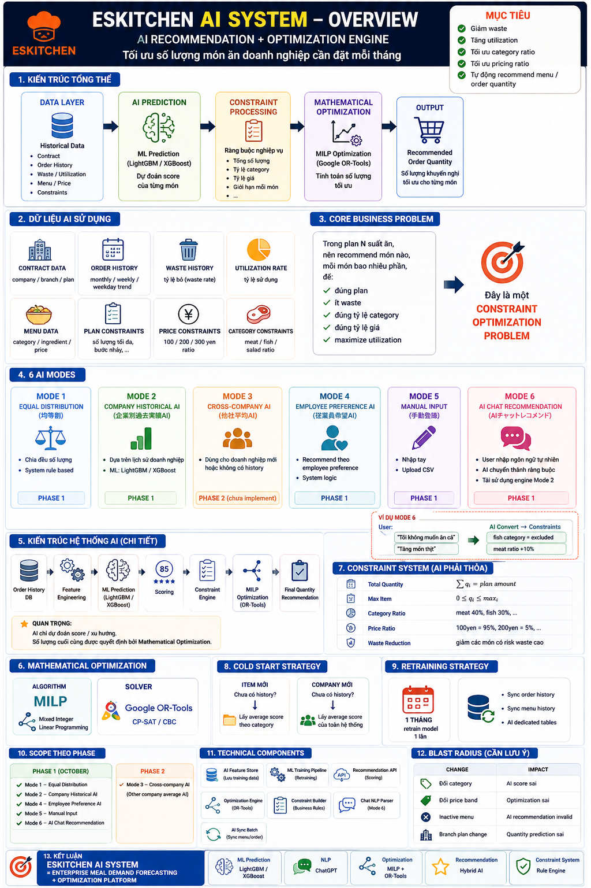
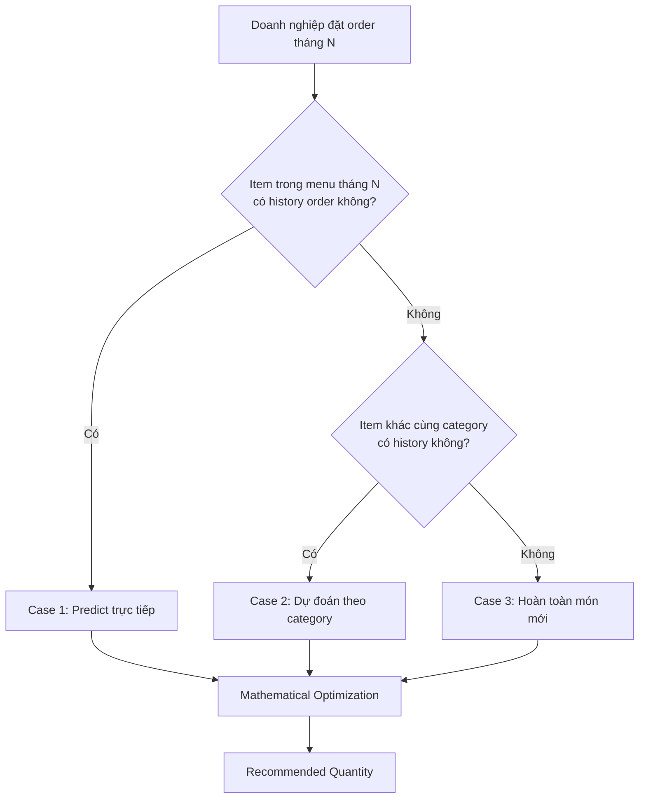
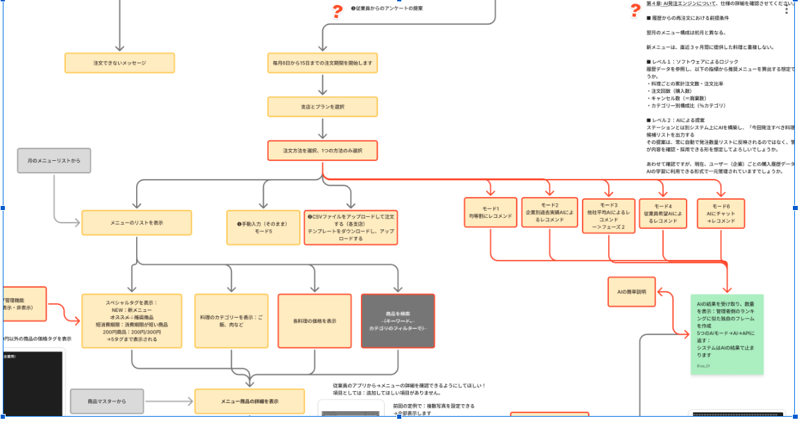

# AI Recommendation Engine — Overview

> **Feature:** ESKITCHEN AI Recommendation + Optimization Engine
> **Phạm vi:** Cross-repo (API + Company Admin Web + Payment App Mobile)
> **Tài liệu nguồn:** `es-kitchen-requirements/req_ai_system/`
> **Phase:** 1 (October release) — Mode 1, 2, 4, 5, 6 in scope · Mode 3 deferred

---

## 1. Mục tiêu

Tối ưu **số lượng món ăn doanh nghiệp đặt mỗi tháng** dựa trên lịch sử order, tỷ lệ waste, ràng buộc plan và sở thích người dùng.

**Kỳ vọng kết quả:**

- Giảm tỷ lệ thực phẩm bỏ phí (waste rate)
- Tăng tỷ lệ sử dụng (utilization rate)
- Tự động hoá quá trình lên đơn theo plan tháng — thay vì admin phải nhập tay từng món

---

## 2. Tổng quan hệ thống



5 layer chính:

| Layer | Vai trò | Công nghệ |
|---|---|---|
| **Data Layer** | Lưu lịch sử (Order History · Contract · Menu · Waste · Plan · Constraints) | PostgreSQL + bảng chuyên dụng cho AI |
| **AI Prediction** | Dự đoán score / số lượng từng món cho doanh nghiệp tháng tới | ML model — LightGBM / XGBoost (Supervised Learning) |
| **Constraint Processing** | Gom các ràng buộc cứng (plan total · price ratio · category ratio · max per item) | Service tổng hợp |
| **Mathematical Optimization** | Quyết định số lượng cuối cùng | MILP — Google OR-Tools (CP-SAT / CBC) |
| **Output** | Recommended Order Quantity (商品ID + 数量 + カテゴリ + 単価) | JSON API response |

---

## 3. Business Problem — Constraint Optimization

Trong khi suất ăn, nhân viên có thể không ăn, mỗi món có nhiều phần, nên phải:

- Dùng **plan** (50 / 100 / 150 phần)
- Giảm **waste** (廃棄)
- Đúng **tỷ lệ category** (肉類 / 魚類 / サラダ / ご飯 …)
- Đúng **tỷ lệ giá** (100¥ / 200¥ / 300¥)
- **Tối đa hoá utilization rate**

Đây là bài toán **Constraint Optimization Problem** — không có lời giải dạng đóng, phải dùng solver.

---

## 4. Sáu Mode — Phân loại theo cách generate recommendation

| Mode | Tên | Phương pháp | Phase | Phân loại |
|---|---|---|---|---|
| **MODE 1** | 均等割にレコメンド (Equal split) | Chia đều theo plan total | Phase 1 | System logic |
| **MODE 2** | 企業別過去実績AIによるレコメンド (Company historical AI) | LightGBM / XGBoost trên lịch sử doanh nghiệp | Phase 1 | **AI machine learning + prediction** |
| **MODE 3** | 他社平均AIによるレコメンド (Industry average AI) | Trung bình toàn ngành — cho doanh nghiệp mới | Phase 2 (deferred) | AI machine learning + prediction |
| **MODE 4** | 従業員希望AIによるレコメンド (Employee preference AI) | Tổng hợp khảo sát từ user mobile app | Phase 1 | System logic |
| **MODE 5** | 手動登録 (Manual input) | Admin nhập tay số lượng | Phase 1 | System logic |
| **MODE 6** | AIにチャットによるレコメンド (Chat AI) | ChatGPT nhận natural language → đưa vào ràng buộc | Phase 1 | ChatGPT + custom constraints |

> Mode 2 là mode **chính xác nhất** vì học trực tiếp từ pattern order của từng doanh nghiệp.

---

## 5. Mode 2 — Chi tiết kiến trúc (AI chính)

### 5.1 Inputs

| # | Nhóm dữ liệu | Field chính | Nguồn |
|---|---|---|---|
| 1 | Lịch sử hợp đồng | Plan info (50/100/150), Company, Branch | DB |
| 2 | Lịch sử order | 注文数 / カテゴリ別注文数 / 注文率 / 注文カテゴリ構成比 | DB (cần aggregate) |
| 3 | Lịch sử waste | 廃棄数, 廃棄率 = 廃棄数 / 注文数 × 100% | DB (cần aggregate) |
| 4 | Lịch sử utilization | 利用率 = (注文数 − 廃棄数) / 注文数 × 100% | DB (cần aggregate) |
| 5 | Past menu | 商品ID, カテゴリ, 主材料, 価格帯, 公開時期 | DB |
| 6 | **Current plan (tháng này)** | Plan total, max per item, price ratio | **API connect** |
| 7 | New menu (tháng này) | 商品ID, 商品詳細 | **API connect** |
| 8 | Constraints | 価格帯構成比 (100/200/300円) | Admin config |

### 5.2 Ba case phân nhánh



#### Case 1 — Item có lịch sử order

| Step | Việc | Input | Output |
|---|---|---|---|
| **Step 1** | AI predict score | Lịch sử order + waste rate + utilization | Score 0–1 cho từng món |
| **Step 2** | Lấy top-K món có score cao | Score từ Step 1 | Danh sách item candidate |
| **Step 3** | AI predict quantity | Lịch sử order của item, plan total | Số lượng dự kiến cho mỗi item |
| **Step 4** | Constraint check | Quantities + ràng buộc | Quantities đã filter |
| **Step 5** | Optimization (MILP) | Quantities + constraints | Recommended order list |

**Cold start:**

- Item mới (chưa có history) → lấy score trung bình của các item cùng category trong cùng doanh nghiệp
- Doanh nghiệp mới → lấy score trung bình của item đó trên toàn hệ thống

#### Case 2 — Item không có history, nhưng category có

| Step | Việc |
|---|---|
| Step 1 | Đối tượng (企業 hoặc toàn hệ thống) — lấy data 6–12 tháng gần nhất |
| Step 2 | Aggregate theo **category** (肉類 / 魚類 / その他) |
| Step 3 | Tính category ratio (ví dụ: 肉 40% / 魚 35% / その他 25%) |
| Step 4 | Áp ratio này lên plan total để ra số lượng từng category |
| Step 5 | Optimization (MILP) phân bổ item cụ thể trong từng category |

#### Case 3 — Hoàn toàn món mới

Admin config sẵn ratio mặc định trong management screen (ví dụ "món mới: tăng 2 phần"). Engine tham chiếu config này khi gặp case 3.

### 5.3 Constraints (ràng buộc cứng — AI phải tuân thủ)

| Loại | Công thức | Ví dụ |
|---|---|---|
| **Plan total** | Σ qᵢ = plan食数 | Tổng 50/100/150 phần |
| **Max per item** | 0 ≤ qᵢ ≤ maxᵢ | Mỗi món ≤ giới hạn riêng |
| **Category ratio** | Σ qᵢ trong category j = pⱼ × plan | 肉 40%, 魚 35% |
| **Price tier ratio** | Σ qᵢ giá k = rₖ × plan | 100¥: 95%, 200¥: 5% |

### 5.4 Algorithm + Solver

- **Algorithm:** Mixed Integer Linear Programming (MILP) — 整数線形計画法
- **Solver:** Google OR-Tools (CP-SAT hoặc CBC)
- **Output schema:**
  ```json
  {
    "items": [
      { "product_id": "...", "quantity": 12, "category": "肉類", "unit_price": 100 }
    ]
  }
  ```

---

## 6. Mode 6 — Chat AI

Cho phép user thêm điều kiện bằng **ngôn ngữ tự nhiên** vào pipeline Mode 2.

| Bước | Việc |
|---|---|
| 1 | User nhập text (ví dụ: "không muốn ăn món cá", "tăng món thịt") |
| 2 | ChatGPT extract intent → mapping vào điều kiện hệ thống định nghĩa sẵn |
| 3 | Inject điều kiện vào bước Constraint Processing của Mode 2 |
| 4 | Chạy lại Step 1–2 của Mode 2 với constraints mới |

**Pre-defined intent mapping (ví dụ):**

| User input | Hành động |
|---|---|
| "không muốn ăn cá" | Loại bỏ category `魚類` khỏi recommendation |
| "tăng món thịt" | Tăng category ratio `肉類` lên +10% |
| "giảm giá" | Tăng tỷ lệ item giá 100¥ |

> Cần giải quyết: **kết hợp custom condition của user với required condition của ESKITCHEN** — strategy đang chờ chốt với khách hàng.

---

## 7. Constraint System — Ma trận ràng buộc

| Constraint | Phạm vi | Ví dụ |
|---|---|---|
| Total quantity | plan total | Σ qᵢ = 100 |
| Max item | per item | qᵢ ≤ 20 |
| Category ratio | per category | 肉 40%, 魚 35% |
| Price ratio | per price tier | 100¥: 95% / 200¥: 5% |
| Waste tolerance | per item | waste rate < threshold |

---

## 8. Cold Start Strategy

| Case | Strategy |
|---|---|
| **Item mới — doanh nghiệp cũ** | Lấy score trung bình của các item cùng category trong cùng doanh nghiệp |
| **Doanh nghiệp mới — item cũ** | Lấy score trung bình của item đó trên toàn hệ thống |
| **Cả 2 đều mới** | Dùng admin-config ratio (Case 3) |

---

## 9. Retraining Strategy

- **Tần suất:** 1 tháng / lần
- **Trigger:** Cronjob
- **Data:** Toàn bộ order mới trong tháng vừa qua được lưu vào **bảng AI chuyên dụng**

**Hai bảng phải có để retraining hoạt động:**

1. **AI order data table** — mỗi lần có order mới, append vào bảng (team AI viết API ingest)
2. **AI menu sync table** — menu mới của tháng sẽ được sync vào bảng chuyên dụng (team AI tự xử lý)

---

## 10. Technical Components

| Component | Technology |
|---|---|
| ML framework | LightGBM / XGBoost (Python) |
| Optimization solver | Google OR-Tools (CP-SAT, CBC) |
| Chat AI (Mode 6) | OpenAI ChatGPT API |
| Backend integration | REST API → es-kitchen-api |
| Data store | PostgreSQL (bảng AI chuyên dụng) |
| Scheduling | Cronjob (monthly retrain) |

---

## 11. Scope Phase 1 (October release)

**In scope:**

- Mode 1 — Equal split (system logic)
- Mode 2 — Company historical AI (ML + optimization)
- Mode 4 — Employee preference AI (system logic)
- Mode 5 — Manual input (system logic)
- Mode 6 — Chat AI (ChatGPT + Mode 2 reuse)

**Deferred to Phase 2:**

- Mode 3 — Industry average AI

---

## 12. Blast Radius — Cần lưu ý

| Khu vực | Tác động |
|---|---|
| **es-kitchen-api** | Thêm module AI orchestration · bảng order/menu chuyên dụng cho AI · API ingest từ team AI |
| **es-kitchen-web-company** | Order list UI — chọn mode 1–6, hiển thị recommendation |
| **es-kitchen-payment-app** | (Mode 4) Khảo sát employee preference |
| **Cronjob infra** | Monthly retrain trigger |
| **External — Team AI** | Build & host model · viết API ingest data · viết API serve prediction |

---

## 13. Business Flow (Tham khảo Figjam)

Flow đặt order của法人顧客 (corporate customer):

```
注文画面 → 支店とプラン選択 → 注文方法を選択 → CSVアップロード
                                              ↓
                                          レコメンド
                                              ↓
            ┌─────────────────────────────────┼──────────────────────────┐
            ↓                ↓                ↓             ↓             ↓
          Mode 1           Mode 2          Mode 4         Mode 5        Mode 6
       (均等割)        (企業別AI)       (従業員希望)    (手動)        (Chat AI)
```

Chi tiết flow nghiệp vụ tham chiếu Figjam: `iCeNUokzaWdL9KhdBqp49b/ES-Kitchen` node `1675-7588`.

**Flow chi tiết (tiếng Nhật):**



---

## 14. Open Questions

| # | Câu hỏi | Cần ai chốt |
|---|---|---|
| 1 | Mode 6 — Combine user custom condition + ES required condition theo strategy nào? | PM + Khách hàng |
| 2 | Định nghĩa cụ thể "tỷ lệ tăng" cho intent natural language (ví dụ +10% hay +20%) | BA + Team AI |
| 3 | Threshold waste rate để loại item khỏi recommendation | BA |
| 4 | Top-K bước 2 của Case 1 — K = ? | Team AI |
| 5 | Khi retraining fail, fallback strategy là gì? | DevOps + Team AI |

---

## 15. Next Steps

1. **BA** — tạo SPEC.md cho từng Mode (1–2, 4–6) qua `/create-spec` workflow
2. **Tech Lead** — design schema cho bảng AI chuyên dụng (order / menu sync) — `/create-design`
3. **Team AI** — confirm API contract giữa es-kitchen-api ↔ AI service (REST endpoints)
4. **PM** — chốt timeline cho Phase 1 (October release) — `/create-plan`