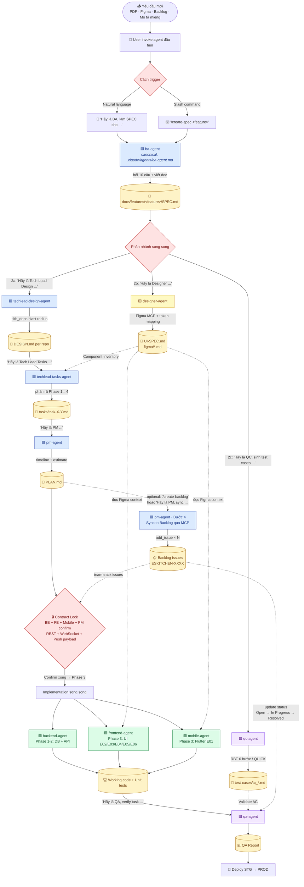

# ESKITCHEN Documentation

Tài liệu kỹ thuật và nghiệp vụ cho dự án **ESKITCHEN Phase 2** — hệ thống quản lý bếp doanh nghiệp cho client Nhật Bản.

## Hệ sinh thái — 7 repos

| Repo | Epic | Vai trò | Stack |
|---|---|---|---|
| `es-kitchen-api` | — | Core API · Business Logic · Database · Auth · Integrations | NestJS / TypeScript / PostgreSQL |
| `es-kitchen-payment-app` | E01 | User Mobile App — order, menu, delivery, payment | Flutter 3.x / Riverpod 3 |
| `es-kitchen-web-company` | E02 | Company Admin Web (58 functions) | React 19 / Vite 7 / Redux Toolkit |
| `es-kitchen-web-admin` | E03 | System Admin Web (160 functions) | React 19 / Vite 7 / Redux Toolkit |
| `es-kitchen-web-supplier` | E04 | Supplier Web — menu, nhận đơn | React 19 / Vite 7 / Redux Toolkit |
| `es-kitchen-web-outsource-web-private` | E05 | Outsource / Internal Private Admin Web | React 19 / Vite 7 / Ant Design 6 |
| `es-kitchen-webapp-driver` | E06 | Driver Web App | React 19 / Vite 7 / Ant Design |

## BMAD Workflow 


Mỗi role là một sub-agent có canonical workflow trong `.claude/agents/`. 

| Bước | Prompt | Output | Agent |
|---|---|---|---|
| 1 | **"Hãy là BA, làm SPEC cho feature `<tên>`"** | `SPEC.md` | `ba-agent` |
| 2a | **"Hãy là Tech Lead Design, làm DESIGN.md từ SPEC: `<path>`"** _(song song)_ | `DESIGN.md` per repo | `techlead-design-agent` |
| 2b | **"Hãy là Designer, tạo UI-SPEC.md + Figma từ SPEC: `<path>`"** _(song song)_ | `UI-SPEC.md` + `figma/*.md` | `designer-agent` |
| 2c | **"Hãy là QC, sinh test cases từ SPEC: `<path>`"** _(song song)_ | `test-cases/tc_*.md` | `qc-agent` |
| 3 | **"Hãy là Tech Lead Tasks, phân rã tasks cho feature: `<feature folder>`"** | `tasks/task-*.md` | `techlead-tasks-agent` |
| 4 | **"Hãy là PM, làm PLAN.md cho feature: `<feature folder>`"** | `PLAN.md` | `pm-agent` |
| 4b _(optional)_ | **"Hãy là PM, sync tasks lên Backlog: `<feature folder>`"** _(slash: `/create-backlog`)_ | Backlog issues qua MCP | `pm-agent` (Bước 4) |
| 5a | **"Hãy là Backend Developer, implement task: `<task-X-Y.md>`"** | Working code | `backend-agent` |
| 5b | **"Hãy là Frontend Developer, implement task: `<task-X-Y.md>`"** | Working code + đọc Figma context | `frontend-agent` |
| 5c | **"Hãy là Mobile Developer, implement task: `<task-X-Y.md>`"** | Working code + đọc Figma context | `mobile-agent` |
| 6 | **"Hãy là QA, verify task: `<task-X-Y.md>`"** | QA Report | `qa-agent` |
| 7 | Execute manual TC + bug reports | Test execution checklist | `qc-agent` |


## Sơ đồ pipeline — Từ yêu cầu đến deploy



**Đọc sơ đồ:**

- 🟦 Planning agents (BA · Tech Lead Design · Tech Lead Tasks · PM) — đọc requirement, sinh docs
- 🟨 Designer agent — tạo Figma screens + UI-SPEC.md (song song bước 2b)
- 🟩 Dev agents (Backend · Frontend · Mobile) — implement task
- 🟪 Quality agents (QC · QA) — sinh test cases · verify code
- 🟡 Artifacts (`SPEC.md` · `DESIGN.md` · `UI-SPEC.md` · `tasks/*.md` · `PLAN.md` · code · test cases · QA Report)
- 🟥 Decision points (cách trigger · phân nhánh · Contract Lock)

**Tín hiệu chính trên sơ đồ:**

- Có **2 cách trigger** ở đầu — natural language hoặc slash command, cả hai cùng load 1 file agent
- **Phân nhánh sau SPEC**: 3 agent chạy song song — **2a** Tech Lead Design (kỹ thuật) · **2b** Designer (UI + Figma) · **2c** QC (test cases). Tech Lead Tasks bắt đầu khi cả DESIGN.md + UI-SPEC.md đã có
- **Sync to Backlog** (mũi tên gạch chấm sau PLAN) là tùy chọn — gọi qua `/create-backlog` hoặc natural language. PM tạo N Backlog issues (1 per task) qua MCP để team track ngoài file `.md`
- **Contract Lock** là gate bắt buộc trước Phase 3 (FE + Mobile song song)
- QA validate AC bằng test cases do QC sinh; đồng thời cập nhật status issue trên Backlog (mũi tên gạch chấm)

---


## Cấu trúc tài liệu

```
docs/
├── backend/                          ← Overview docs per backend repo
│   └── es-kitchen-api/overview/      ← Structure · ERD · API catalog · Patterns
├── frontend/                                  ← Overview docs per FE repo
│   ├── es-kitchen-web-admin/                  ← E03 — System Admin
│   ├── es-kitchen-web-company/                ← E02 — Company Admin
│   ├── es-kitchen-web-supplier/               ← E04 — Supplier
│   ├── es-kitchen-web-outsource-web-private/  ← E05 — Outsource/Internal
│   └── es-kitchen-webapp-driver/              ← E06 — Driver
├── mobile/
│   └── es-kitchen-payment-app/       ← E01 — Mobile App
├── features/                         ← Long-memory cho mọi feature (BMAD output)
│   └── <feature-name>/
│       ├── SPEC.md                   ← BA (nghiệp vụ + ## Screens table)
│       ├── UI-SPEC.md                ← Designer (screen inventory, components, token usage)
│       ├── PLAN.md                   ← PM
│       ├── figma/                    ← Designer
│       │   ├── figma_<Component>_context.md
│       │   └── figma_<Component>.png
│       └── <repo-name>/              ← per repo bị ảnh hưởng
│           ├── DESIGN.md             ← Tech Lead Design
│           └── tasks/task-X-Y.md     ← Tech Lead Tasks
└── quality/                          ← Quality reports
```

