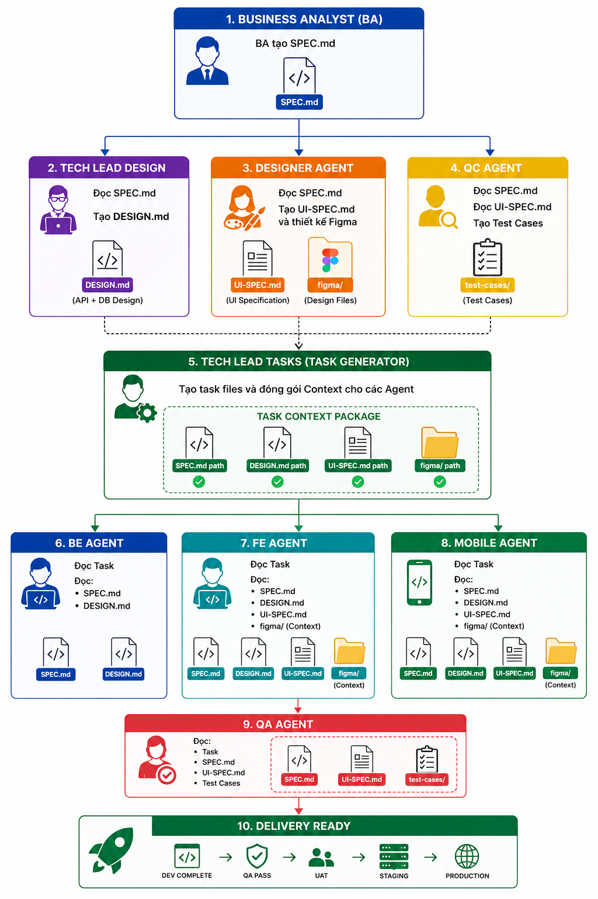
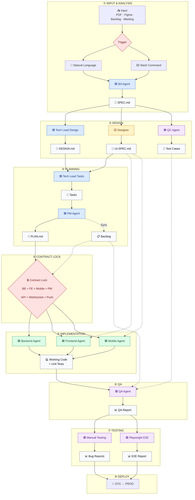

# ESKITCHEN Documentation

Tài liệu kỹ thuật và nghiệp vụ cho dự án **ESKITCHEN Phase 2** — hệ thống quản lý bếp doanh nghiệp cho client Nhật Bản.

## Hệ sinh thái — 9 repos

| Repo | Epic | Vai trò | Stack |
|---|---|---|---|
| `es-kitchen-api` | — | Core API · Business Logic · Database · Auth · Integrations | NestJS 11 / TypeScript / PostgreSQL / TypeORM 0.3 |
| `es-kitchen-payment-app` | E01 | User Mobile App — order, menu, delivery, payment | Flutter 3.10 / Dart / Riverpod 3 / Retrofit / auto_route |
| `es-kitchen-web-company` | E02 | Company Admin Web | React 19 / Vite 7 / Redux Toolkit / AntD 6.2 |
| `es-kitchen-web-admin` | E03 | System Admin Web (60+ pages) | React 19 / Vite 7 / Redux Toolkit / AntD 6.2 |
| `es-kitchen-web-supplier` | E04 | Supplier Web — menu, nhận đơn | React 19 / Vite 8 / Redux Toolkit / AntD 6.4 |
| `es-kitchen-web-outsource-web-private` | E05 | Outsource / Internal Private Admin Web | React 19 / Vite 8 / Redux Toolkit / AntD 6.4 |
| `es-kitchen-webapp-driver` | E06 | Driver Web App (mobile-first web) | React 19 / Vite 8 / **shadcn + Base UI** / **Zustand** |
| `es-kitchen-webapp-payment` | E07 | User Web Ordering (QR scan · cart · elepay) — parallel to E01 Mobile | React 19 / Vite 8 / **shadcn + Base UI** / **Zustand** / PWA |
| `es-kitchen-testing` | — | E2E Testing — Playwright specs + execution reports (độc lập, root level) | Playwright / TypeScript |

## BMAD Workflow 



Mỗi role là một sub-agent có canonical workflow trong `.claude/agents/`. 

| Bước | Prompt | Output | Agent |
|---|---|---|---|
| 1 | **"Hãy là BA, làm SPEC cho feature `<tên>`"** | `SPEC.md` | `ba-agent` |
| 2a | **"Hãy là Tech Lead Design, làm DESIGN.md từ SPEC: `<path>`"** _(song song)_ | `DESIGN.md` per repo | `techlead-design-agent` |
| 2b | **"Hãy là Designer, tạo UI-SPEC.md + Figma từ SPEC: `<path>`"** _(song song)_ | `UI-SPEC.md` + `figma/*.md` | `designer-agent` |
| 2c | **"Hãy là QC, sinh test cases từ SPEC: `<path>`"** _(song song)_ | `test-cases/tc_*.md` | `qc-agent` |
| 3 | **"Hãy là Tech Lead Tasks, phân rã tasks cho feature: `<feature folder>`"** | `tasks/task-*.md` | `techlead-tasks-agent` |
| 4 | **"Hãy là PM, làm PLAN.md cho feature: `<feature folder>`"** | `PLAN.md` | `pm-agent` |
| 4b _(optional)_ | **"Hãy là PM, sync tasks lên Backlog: `<feature folder>`"** _(slash: `/create-backlog`)_ | Backlog issues qua MCP | `pm-agent` (Bước 4) |
| 5a | **"Hãy là Backend Developer, implement task: `<task-X-Y.md>`"** | Working code | `backend-agent` |
| 5b | **"Hãy là Frontend Developer, implement task: `<task-X-Y.md>`"** | Working code + đọc Figma context | `frontend-agent` |
| 5c | **"Hãy là Mobile Developer, implement task: `<task-X-Y.md>`"** | Working code + đọc Figma context | `mobile-agent` |
| 6 | **"Hãy là QA, verify task: `<task-X-Y.md>`"** | QA Report | `qa-agent` |
| 7a | Execute manual TC + bug reports | Test execution checklist | `qc-agent` |
| 7b _(optional)_ | **"Hãy là QC, sinh regression suite: `<feature>`"** | Regression suite | `qc-agent` |
| 7c | **"Hãy là QC Automation, test feature: `<path>`, Figma: `<url>`"** _(song song với 7a — thêm `testcases: <path>` nếu có TC file)_ | Playwright `.spec.ts` + `execution-report.md` | `qc-automation-agent` |


## Sơ đồ pipeline — Từ yêu cầu đến deploy
## Pipeline — Từ yêu cầu đến deploy




**Đọc sơ đồ:**

- 🟦 Planning agents (BA · Tech Lead Design · Tech Lead Tasks · PM) — đọc requirement, sinh docs
- 🟨 Designer agent — tạo Figma screens + UI-SPEC.md (song song bước 2b)
- 🟩 Dev agents (Backend · Frontend · Mobile) — implement task
- 🟪 Quality agents (QC · QA · QC-Automation) — sinh test cases · verify code · E2E test tự động
- 🟡 Artifacts (`SPEC.md` · `DESIGN.md` · `UI-SPEC.md` · `tasks/*.md` · `PLAN.md` · code · test cases · QA Report)
- 🟥 Decision points (cách trigger · phân nhánh · Contract Lock)


---


## Cấu trúc tài liệu

```
docs/
├── backend/                          ← Overview docs per backend repo
│   └── es-kitchen-api/overview/      ← Structure · ERD · API catalog · Patterns
├── frontend/                                  ← Overview docs per FE repo
│   ├── es-kitchen-web-admin/                  ← E03 — System Admin
│   ├── es-kitchen-web-company/                ← E02 — Company Admin
│   ├── es-kitchen-web-supplier/               ← E04 — Supplier
│   ├── es-kitchen-web-outsource-web-private/  ← E05 — Outsource/Internal
│   ├── es-kitchen-webapp-driver/              ← E06 — Driver
│   └── es-kitchen-webapp-payment/             ← E07 — User Web Ordering
├── mobile/
│   └── es-kitchen-payment-app/       ← E01 — Mobile App
├── features/                         ← Long-memory cho mọi feature (BMAD output)
│   └── <feature-name>/
│       ├── SPEC.md                   ← BA (nghiệp vụ + ## Screens table)
│       ├── UI-SPEC.md                ← Designer (screen inventory, components, token usage)
│       ├── PLAN.md                   ← PM
│       ├── figma/                    ← Designer
│       │   ├── figma_<Component>_context.md
│       │   └── figma_<Component>.png
│       └── <repo-name>/              ← per repo bị ảnh hưởng
│           ├── DESIGN.md             ← Tech Lead Design
│           └── tasks/task-X-Y.md     ← Tech Lead Tasks
└── quality/                          ← Manual QC reports (TC execution, bug reports)

# E2E test results (Playwright) → es-kitchen-testing/reports/<feature>/execution-report.md
```

