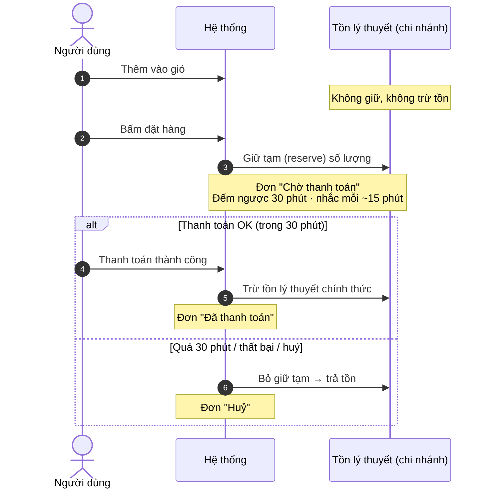
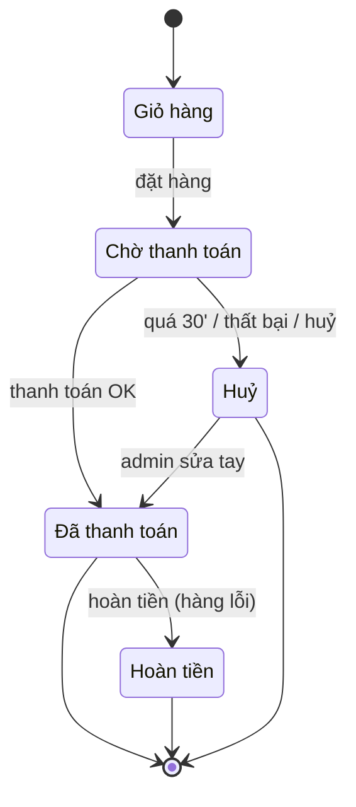
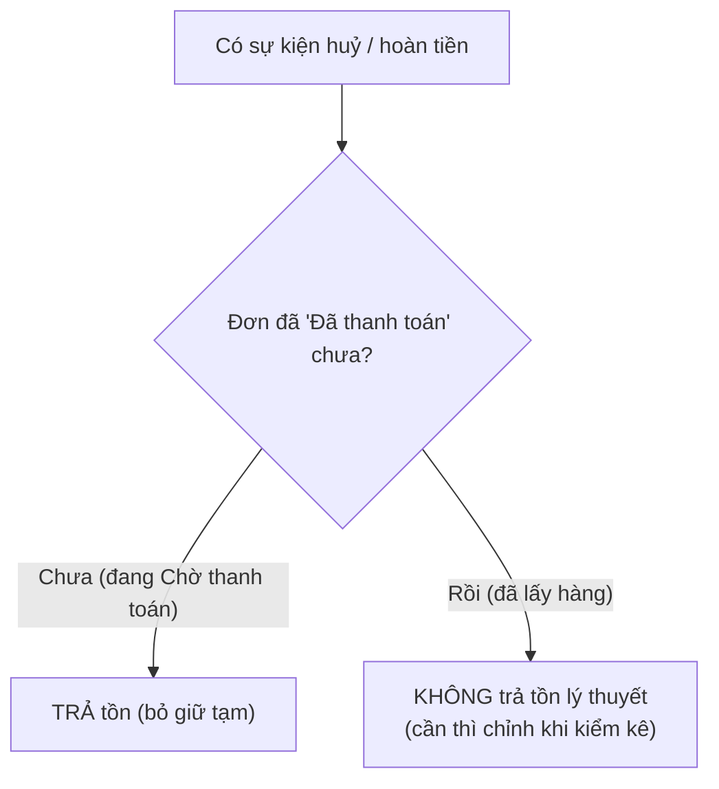
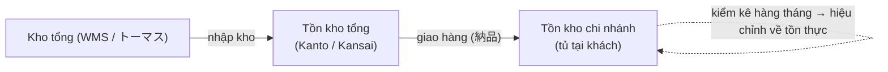
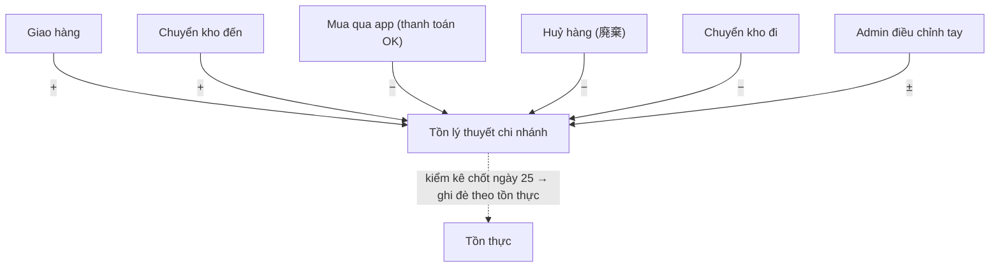
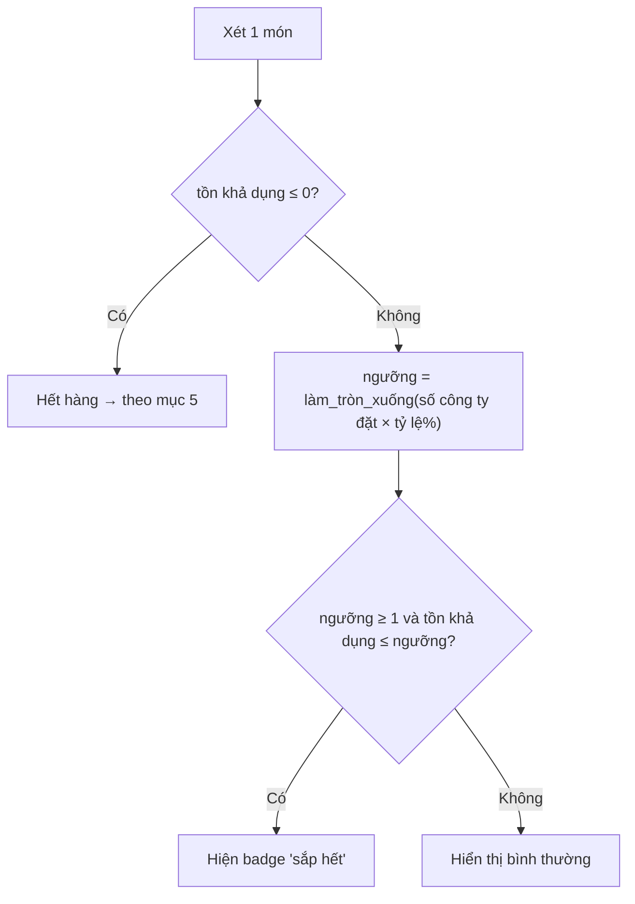
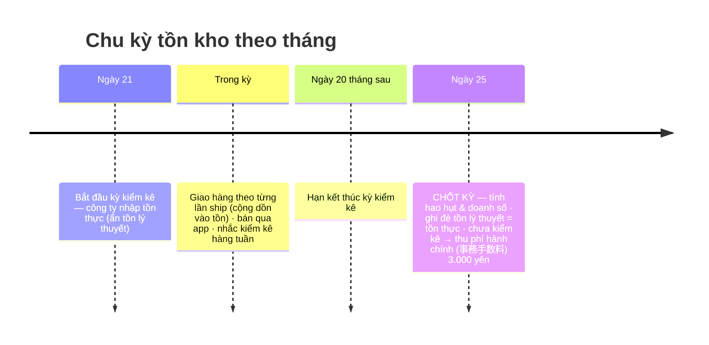
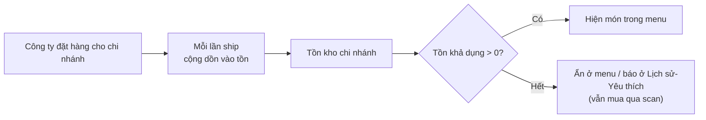

> **参考（個人アプリ・ESQR の在庫の動き。開発者向け・ベトナム語）。在庫の正は `docs/01_仕様/60_在庫/在庫.md`。** 次の点は古い：§10「Trần hàng đông ≤ 30%」→ 冷凍は個数で決める（割合は持たない）。

# SPEC TỒN KHO — App/ESQR & Chi nhánh (cho Dev)

> Nguồn: các buổi họp 31/07, 25/08, 01/09, 02/09, 04/09 (bổ sung 03/31), trả lời của hong 30/09/2026 (K-15, K-20). Con số/thời gian giữ đúng theo họp.
> **Ngôn ngữ:** viết bằng tiếng Việt cho dev. Tiếng Nhật trong ngoặc `(…)` chỉ là **tên trường/màn hình thật trong hệ thống** để đối chiếu.
> **Phạm vi:** logic tồn kho khi người dùng mua trên App/ESQR + tồn kho ở chi nhánh + kiểm kê + hiển thị menh theo tồn (Phase 2).

---

## 0. Thuật ngữ (đọc trước khi code)

| Tiếng Việt (dùng trong spec) | Tiếng Nhật (tên hệ thống) | Nghĩa |
|---|---|---|
| **Tồn lý thuyết** | 理論在庫 | Số tồn hệ thống tự tính (nhập − bán − huỷ…). Là cơ sở tính tồn khả dụng. **Có thể âm.** |
| **Tồn thực** | 実在庫 | Số thực đếm được trong tủ, nhập bằng kiểm kê. |
| **Giữ tạm** | reserve | Số bị "giữ chỗ" khi đã đặt hàng nhưng chưa thanh toán (chặn mua trùng). |
| **Khả dụng** | — | = Tồn lý thuyết − Giữ tạm. Số thực sự còn bán được ngay. |
| **Số công ty đặt** | 発注数 / số_order | Số lượng chi nhánh đã đặt cho 1 món trong kỳ (= số giao vào tủ). |
| **Chi nhánh** | 拠点 | Điểm đặt tủ tại khách. Mỗi chi nhánh có tồn riêng. |
| **Giao hàng / lần ship** | 納品 / 出荷 | 1 đợt giao hàng vào tủ của chi nhánh. |
| **Kiểm kê** | 棚卸し | Đếm tồn thực định kỳ để đối chiếu. |
| **Chốt kỳ** | 締め | Thời điểm chốt số liệu tháng (ngày 25). |
| **Hao hụt quản lý** | 管理ロス | Chênh lệch tồn lý thuyết vs tồn thực (dùng tính phí). |
| **Gói / khoá học** | プラン / コース | Gói dịch vụ của chi nhánh (100, 200… suất). |
| **Master gói** | プランマスタ | Nơi cấu hình thông số theo từng gói (giá, tỷ lệ badge…). |
| **Scan** | — | Mua bằng cách quét mã sản phẩm, không qua menu. |

---

## 1. DÒNG THỜI GIAN 1 — Vòng đời 1 đơn hàng (tính theo phút)

**Các mốc thời gian & quy tắc:**

| Mốc | Hành động của user | Tác động tồn kho | Quy tắc |
|---|---|---|---|
| T0 | Thêm vào giỏ | **Không** động vào tồn | TK-01 |
| T1 | Bấm đặt hàng (màn xác nhận) | **Giữ tạm (reserve)** đúng số lượng | TK-02 |
| T1 → T1+30' | Đơn "Chờ thanh toán", nhắc mỗi ~15 phút | Vẫn đang giữ tạm | TK-04 |
| Nếu thanh toán OK trong 30' | | **Trừ tồn lý thuyết chính thức** | TK-03 |
| Nếu quá 30' / thất bại / huỷ | | **Trả tồn** (bỏ giữ tạm) | TK-04 |

**Ví dụ:** Trà đang có tồn lý thuyết 10.
1. Thêm 3 vào giỏ → tồn 10, khả dụng 10.
2. Bấm đặt hàng → giữ tạm 3 → tồn 10, **khả dụng 7**, đơn "Chờ thanh toán".
3a. Trả tiền OK trong 30' → tồn lý thuyết còn **7**.
3b. Quá 30' không trả → bỏ giữ tạm → tồn về **10**.

---

## 2. Trạng thái đơn hàng & tác động tồn

| Chuyển trạng thái | Tác động tồn |
|---|---|
| Giỏ → Chờ thanh toán | Giữ tạm (chưa trừ tồn lý thuyết) |
| Chờ thanh toán → Đã thanh toán | **Trừ** tồn lý thuyết |
| Chờ thanh toán → Huỷ | **Trả tồn** (bỏ giữ tạm) |
| Đã thanh toán → Hoàn tiền | **KHÔNG** trả tồn lý thuyết (xem mục 3) |
| Huỷ → Đã thanh toán (admin sửa tay) | Trừ tồn lý thuyết (có thể âm) + **bắt buộc nhập lý do & lưu log** |

---

## 3. Khi nào TRẢ tồn / KHÔNG trả tồn

- **TK-05** — Mốc quyết định = **trạng thái thanh toán của đơn** (KHÔNG liên quan giao hàng, vì hàng đã nằm sẵn trong tủ, user tự lấy).
- **TK-06** — Đơn **chưa hoàn tất** (Chờ thanh toán bị huỷ/thất bại/quá 30') → **TRẢ tồn**.
- **TK-07** — Đơn **đã thanh toán** rồi hoàn tiền (ví dụ hàng lỗi) → **KHÔNG trả tồn lý thuyết**; nếu cần thì chỉnh qua kiểm kê.

**Ví dụ:** đặt Trà chưa trả tiền, quá 30' → huỷ → tồn +3 trở lại. Đã mua Trà rồi phát hiện hộp lỗi → hoàn tiền → **tồn giữ nguyên** (hộp đó đã rời tủ).

---

## 4. Tồn kho ở chi nhánh

### 4.1 Hai cấp tồn kho

### 4.2 Tồn lý thuyết chi nhánh tăng/giảm khi nào

**Quy tắc:**
- **TK-08** — Mỗi chi nhánh có tồn riêng. Giao dịch app trừ đúng tồn của **chi nhánh mà user thuộc về** (nhận diện qua **mã chi nhánh / QR** lúc mua).
- **TK-09** — Guest / chưa đăng ký mã chi nhánh: chỉ mua qua **scan**, hiển thị **giá chuẩn**; trước khi thanh toán yêu cầu nhập mã chi nhánh (giá có thể đổi theo hợp đồng chi nhánh → hiện popup báo).
- **TK-10** — **Mua từ Menu / Lịch sử mua / Yêu thích:** giới hạn số lượng mua theo tồn khả dụng của chi nhánh (`tồn khả dụng = tồn lý thuyết − giữ tạm`). Kiểm tra lúc chọn/thêm giỏ **và** kiểm tra lại lúc xác nhận đặt. Việc kiểm tra và giữ tạm phải thực hiện đồng thời để tránh nhiều user mua trùng phần tồn cuối cùng.
- **TK-11** — **Tồn âm được phép** (do scan khi hết, hoặc admin sửa tay); đưa về đúng bằng kiểm kê.

### 4.3 Điều chỉnh tồn thủ công — chỉ do System admin
- **TK-12** — **KHÔNG có luồng công ty trả hàng (返品)** để điều chỉnh tồn.
- **TK-13** — Điều chỉnh tay **chỉ do System admin**, cho 2 trường hợp:
  - **Chuyển kho giữa các chi nhánh (在庫移動):** admin **trừ** tồn chi nhánh nguồn, **cộng** tồn chi nhánh đích (không tự tính chi phí; cùng pháp nhân thì bù trừ, khác pháp nhân/chi nhánh còn đang xem lại).
  - **Đổi hàng hư hỏng/lỗi (代替品):** admin cập nhật tồn (trừ hàng hỏng, cộng/điều chỉnh hàng thay).
- **TK-14** — Mọi lần điều chỉnh tay: **bắt buộc nhập lý do + lưu log**.

**Ví dụ:** Chi nhánh A còn 4 Trà, chuyển hết sang B → admin: A −4 (còn 0), B +4.

### 4.4 Gửi trả hàng về công ty sau kiểm kê (2026/09/30 thêm mới)
- **TK-35** — **Không có chức năng tạo order sản phẩm thủ công** (商品オーダーの手動新規作成). Hàng không dùng cho tháng sau, sau kiểm kê, được **gửi trả về công ty (自社)** bằng cách đăng ký ở **màn hình riêng tạo chỉ thị xuất hàng không kèm đặt hàng** (発注を伴わない出荷指示) và **xuất CSV cho トーマス**. Sample kinh doanh / sample thử nghiệm (営業サンプル・試験用サンプル) vẫn đi qua hợp đồng như cũ (tham chiếu: `発注仕入入荷_詳細要件仕様.md` REQ-PO-603).

---

## 5. Khi HẾT HÀNG TRÊN APP (tồn khả dụng ≤ 0) — hiển thị theo màn hình

- **TK-15** — **Màn Menu:** khi tồn khả dụng ≤ 0 thì **ẩn hẳn** món (không hiển thị).
- **TK-16** — **Màn Lịch sử mua (購入履歴) / Yêu thích (お気に入り):** khi tồn khả dụng ≤ 0 thì vẫn hiển thị món nhưng ghi câu **"次回の登場をご期待ください。"** (nghĩa: *Hẹn gặp lại ở kỳ sau*), **không bấm vào chi tiết được**, **không thêm vào giỏ được**.
- **TK-17** — **Mua bằng Scan là ngoại lệ của quy tắc kiểm tra tồn:**
  - Mỗi lần scan chỉ được mua **01 sản phẩm**; không hiển thị và không cho thay đổi số lượng. Muốn mua sản phẩm tiếp theo, user phải scan lại.
  - Cho phép tạo đơn và thanh toán **không phụ thuộc tồn lý thuyết hoặc tồn khả dụng**, vì việc user scan sản phẩm tại tủ được coi là dấu hiệu hàng thực tế vẫn còn.
  - Khi tạo đơn Chờ thanh toán, hệ thống vẫn giữ tạm 1 sản phẩm. Thanh toán thành công thì trừ 1 tồn lý thuyết và xoá giữ tạm; tồn lý thuyết **được phép âm**. Quá 30 phút, thanh toán thất bại hoặc user huỷ thì chỉ xoá giữ tạm, không trừ tồn lý thuyết.
  - Tồn âm do Scan được ghi nhận và sẽ được đối chiếu/điều chỉnh trong kỳ kiểm kê; **không yêu cầu System admin kiểm tra hoặc phê duyệt realtime**.
- **TK-18** — **Giỏ hàng:** món có tồn khả dụng ≤ 0 mà đang trong giỏ → **tự xoá khi mở lại app** (kiểm tra tồn lúc khởi động). Quy tắc này không áp dụng cho đơn tạo bằng Scan.

**Ví dụ:** Trà hết → menu không còn Trà; vào "Yêu thích" vẫn thấy Trà + câu "次回の登場をご期待ください。", bấm không vào được; quét mã hộp Trà thật trong tủ thì vẫn mua được. Mỗi lần scan chỉ mua 1 hộp; nếu tồn lý thuyết đang là 0 thì sau khi thanh toán thành công, tồn lý thuyết trở thành −1.

---

## 6. Badge "sắp hết" (残りわずか)

- **TK-19** — Ngưỡng tính theo **% của số công ty đặt** cho món đó, **KHÔNG** dùng con số tiêu chuẩn của admin (số chuẩn không phản ánh thực tế từng chi nhánh).
- **TK-20** — Công thức: **`ngưỡng = làm_tròn_xuống(số_công_ty_đặt × tỷ_lệ%)`**. `tỷ_lệ%` **cấu hình trong màn Master gói (プランマスタ) theo từng gói — KHÔNG cố định trong code**.
- **TK-21** — Hiện badge khi: **tồn khả dụng > 0** VÀ **ngưỡng ≥ 1** VÀ **tồn khả dụng ≤ ngưỡng**.
- **TK-22** — User **không thấy số tồn cụ thể**, chỉ thấy mức "sắp hết".
- **TK-23** — Công ty **KHÔNG** tự bật/tắt badge. **Không** áp dụng rule "gói ≤ 100 thì ẩn" (đã bỏ).

**Ví dụ (tỷ lệ 25%):**
- Đặt 12 → ngưỡng = làm_tròn_xuống(12 × 25%) = **3** → còn ≤ 3 mới hiện "sắp hết".
- Đặt 5 → ngưỡng = 1 → còn 1 mới hiện.
- Đặt 3 → ngưỡng = làm_tròn_xuống(0.75) = **0** → **không bao giờ hiện** (đơn nhỏ tự loại).

---

## 7. DÒNG THỜI GIAN 2 — Chu kỳ 1 tháng (đặt hàng → giao → bán → kiểm kê → chốt)

### 7.1 Kiểm kê (棚卸し)
- **TK-24** — Kiểm kê **1 lần/tháng**, kỳ **21 → 20 tháng sau**. Người làm: **công ty tự làm** hoặc **tài xế ES**.
- **TK-25** — Công ty **nhập số đếm thực và gửi lên (submit)**. Màn hình **chạy được trên điện thoại**, **xuất PDF** để làm trên giấy (phiếu kiểm tra / 点検表); **ẩn tồn lý thuyết**, chỉ cho nhập tồn thực (chống gian lận). Áp dụng như nhau dù người làm là công ty hay tài xế ES (2026/09/30 thay đổi. Cũ: không ghi rõ trường hợp tài xế ES làm kiểm kê).
- **TK-34** — **Tài xế ES giao hàng (ES配送便ドライバー)** được **xem tồn lý thuyết** ở bước kiểm tra tồn/huỷ khi giao hàng (**STEP2 在庫・廃棄確認**). Đây là màn khác với kiểm kê hàng tháng (TK-24/25): kiểm kê hàng tháng và phiếu kiểm tra **không** hiển thị tồn lý thuyết (2026/09/30 thêm mới. Tham chiếu: `ピッキング出荷配送ドライバー_詳細要件仕様.md` REQ-DL-151, `発注仕入入荷_詳細要件仕様.md` REQ-PO-413).
- **TK-26** — **Nhắc hàng tuần**; nếu **đến ngày 25 chưa kiểm kê → thu phí hành chính (事務手数料) 3.000 yên** (02/10/2026 đổi tên. Cũ: phạt / phí quản lý).
- **TK-26b** (02/10/2026) — Hợp đồng có cờ **「惣菜買取」** (công ty khách mua đứt toàn bộ hàng giao) **không thuộc quản lý tồn kho**: không cần kiểm kê, không thu 事務手数料, không tính 管理ロス. Phần trả sau = Σ(số lượng giao × (đơn giá − 100 yên)), tính tự động từ dữ liệu giao hàng (契約 REQ-CT-305・306).

### 7.2 Con số kiểm kê dùng để làm gì
- **TK-27** — Số công ty gửi lên dùng cho **2 việc:**
  - **(a) Tính hao hụt:** so với tồn lý thuyết.
  - **(b) Sau khi chốt kỳ (ngày 25): coi là tồn kho thực tế → GHI ĐÈ tồn lý thuyết = số này**, làm điểm xuất phát cho kỳ sau.
- **TK-28** — **Hao hụt quản lý** = (tồn lý thuyết − tồn thực). Vượt ngưỡng theo gói (ví dụ gói 100 = 300 yên) → **tính vào hóa đơn**; trong ngưỡng thì ES chịu. Đơn giá tính = giá chuẩn (trước điều chỉnh).
- **TK-29** — **Hao hụt do hết hạn:** nguyên tắc không tính phí; **tỷ lệ huỷ > 3%** → cảnh báo trên dashboard (gợi ý hạ gói).

**Ví dụ (loss + ghi đè):** Cuối kỳ tồn lý thuyết = 5. Công ty đếm thực còn 3 và gửi lên.
- (a) Hao hụt = 5 − 3 = **2** → quy tiền, so ngưỡng gói (vd gói 100 = 300 yên): trong ngưỡng ES chịu, vượt thì tính vào hóa đơn.
- (b) Sau chốt ngày 25: **tồn lý thuyết được set lại = 3** → kỳ sau bắt đầu từ 3 (+ hàng ship mới − bán).

---

## 8. Phase 2 — Hiển thị menu theo tồn kho (theo từng lần ship)

**Khác biệt:**
- **Phase 1:** menu hiển thị 2 tháng gần nhất theo **ngày công khai** (公開予定日), **chưa** gắn tồn kho.
- **Phase 2:** menu hiển thị **theo tồn kho chi nhánh**; tồn kho quản lý **theo từng lần ship**.

**Quy tắc:**
- **TK-30** — Menu của 1 chi nhánh = **tất cả món đang công khai, LỌC theo tồn khả dụng của chi nhánh > 0** (món không còn tồn khả dụng ở chi nhánh → không hiện ở menu; vẫn có thể mua bằng Scan theo TK-17).
- **TK-31** — Mỗi lần ship **cộng dồn** vào tồn hiện có (**không reset**).
- **TK-32** — Tồn khả dụng > 0 → hiện; tồn khả dụng ≤ 0 → xử lý theo mục 5; vẫn mua qua Scan theo TK-17.
- **TK-33** — **Hạn dùng / lô hàng (賞味期限/lot)** quản lý **theo từng lần ship** (hiện chưa gặp xung đột vì mỗi tháng menu khác món, nhưng vẫn phải theo dõi).

**Ví dụ (cộng dồn):** cùng món Trà: ship lần 1 giao 10, bán 6 → còn **4**; ship lần 2 giao thêm 10 → tồn = 4 + 10 = **14** (không reset về 10).

---

## 9. Bảng demo tổng hợp (kịch bản theo thời gian)

**Số liệu ví dụ:** Món "Trà", số công ty đặt = **12**, tỷ lệ badge = **25%** → ngưỡng = **3**. Tồn đầu kỳ = **12**. Giữ hàng = **30 phút**.

| # | Sự kiện | Trạng thái đơn | Tồn lý thuyết | Giữ tạm | Khả dụng | Hiển thị / hành vi | Ghi chú |
|---|---|---|---|---|---|---|---|
| 1 | Hiển thị menu | — | 12 | 0 | 12 | Hiện "Trà", chưa badge (12 > 3) | badge khi khả dụng ≤ 3 |
| 2 | Thêm 3 vào giỏ | — | 12 | 0 | 12 | Chưa động tồn | không giữ tạm ở giỏ |
| 3 | Bấm đặt hàng | Chờ thanh toán | 12 | 3 | 9 | Đếm ngược 30', nhắc mỗi 15' | giữ tạm = 3 |
| 4a | Thanh toán OK | Đã thanh toán | **9** | 0 | 9 | Trừ tồn thật | — |
| 4b | Quá 30'/thất bại/huỷ | Huỷ | 12 | 0 | 12 | Trả tồn | bỏ giữ tạm |
| 5 | Khả dụng còn 3 | — | 3 | 0 | 3 | **Hiện badge "sắp hết"** (3 ≤ 3) | ngưỡng = 3 |
| 6 | Hết (0) | — | 0 | 0 | 0 | Menu: **ẩn món**; Lịch sử/Yêu thích: **"次回の登場をご期待ください。" + khoá** | vẫn mua qua scan |
| 7 | Scan mua khi đã hết | Đã thanh toán | **−1** | 0 | −1 | Vẫn cho mua; mỗi lần scan chỉ mua 1 | bỏ qua check tồn; không cần admin duyệt realtime |
| 8 | Chọn số lượng từ Menu | — | 1 | 0 | 1 | Tối đa = tồn khả dụng (1) | check khi chọn & xác nhận; không áp dụng cho Scan |
| 9 | Admin sửa Huỷ→Đã TT | Đã thanh toán | có thể âm | — | — | Cho phép + **bắt buộc lý do & log** | chỉnh khi kiểm kê |
| 10 | Hoàn tiền đơn đã TT (lỗi) | Hoàn tiền | **không đổi** | 0 | — | KHÔNG trả tồn lý thuyết | khác huỷ đơn chưa TT |
| 11 | Kiểm kê & chốt ngày 25 | — | ghi đè theo tồn thực | — | — | Ẩn tồn lý thuyết, chỉ nhập thực | hao hụt vượt ngưỡng → tính phí |

---

## 10. Tham số (constants) để dev cấu hình

| Tham số | Giá trị | Nguồn |
|---|---|---|
| Thời gian giữ đơn "Chờ thanh toán" | **30 phút** (trước là 6 tiếng) | 01/09 |
| Chu kỳ nhắc thanh toán | mỗi ~15 phút | 01/09 |
| Kỳ kiểm kê | 21 → 20 tháng sau | 25/08 |
| Ngày chốt kỳ | 25 | 25/08 · 02/09 |
| Phí hành chính (事務手数料) khi chưa kiểm kê (đến ngày 25) — cũ: phạt | 3.000 yên | 25/08 (đổi tên 02/10) |
| Ngưỡng hao hụt tính phí | theo gói (vd gói 100 = 300 yên) | 25/08 |
| Ngưỡng cảnh báo tỷ lệ huỷ | > 3% | 25/08 |
| Trần hàng đông trong gói | ≤ 30% | 21/08 |
| Ngưỡng badge "sắp hết" | làm_tròn_xuống(số công ty đặt × tỷ lệ%) | 01/09 |
| Tỷ lệ badge | **cấu hình trong màn Master gói theo từng gói — không cố định trong code** | 01/09 |
| Giới hạn mua từ Menu | ≤ tồn khả dụng chi nhánh | 01/09 |
| Giới hạn mua bằng Scan | 01 sản phẩm/lần scan; bỏ qua kiểm tra tồn | Bổ sung |

---

## 11. Các quyết định đã chốt (tham chiếu nhanh)

- **Trừ tồn:** giỏ (không) → đặt hàng (giữ tạm) → thanh toán OK (trừ tồn lý thuyết). Giữ hàng 30 phút.
- **Trả tồn:** chỉ khi đơn **chưa thanh toán**; đơn **đã thanh toán** hoàn tiền thì không trả.
- **Điều chỉnh tay:** chỉ System admin (chuyển kho, đổi hàng lỗi) + lý do & log. **Không có công ty trả hàng.**
- **Hết hàng:** ẩn ở menu; ở Lịch sử/Yêu thích báo "次回の登場をご期待ください。" + khoá; vẫn mua qua Scan. Mỗi lần Scan chỉ mua 1 sản phẩm, bỏ qua kiểm tra tồn, cho phép tồn lý thuyết âm và không cần admin duyệt realtime; giỏ tự xoá món hết khi mở lại app.
- **Badge "sắp hết":** làm_tròn_xuống(số công ty đặt × tỷ lệ%); tỷ lệ cấu hình trong Master gói theo gói; không có toggle cho công ty; **bỏ rule gói ≤ 100**.
- **Kiểm kê:** công ty gửi số thực → tính hao hụt + sau chốt ghi đè tồn lý thuyết. Chốt ngày 25. Kiểm kê hàng tháng ẩn tồn lý thuyết (dù công ty hay tài xế ES làm); tài xế ES chỉ xem tồn lý thuyết ở STEP2 khi giao hàng (2026/09/30).
- **Gửi trả hàng về công ty:** không tạo order thủ công; dùng màn chỉ thị xuất hàng không kèm đặt hàng → CSV cho トーマス (2026/09/30).
- **Phase 2:** menu = món công khai lọc theo tồn khả dụng của chi nhánh > 0; tồn cộng dồn theo từng lần ship; Scan là luồng ngoại lệ.

---

> Tài liệu liên quan: `発注仕入入荷_詳細要件仕様.md` (mục 7C, REQ-PO-418b/419/419b), `要件定義まとめ_ESKITCHEN.md` (REQ-MO-051〜055, 061), `プランマスタ_仕様まとめ.md` (残りわずか率 / REQ-PM-009,010).

---

## 12. Lịch sử thay đổi (変更履歴)

| Ngày họp (会議日) | Đối tượng (対象・節) | Trước (変更前) | Sau (変更後) | Lý do (変更理由) | Căn cứ (根拠) | Trạng thái (状態) |
|---|---|---|---|---|---|---|
| 2026/09/30 | Hiển thị tồn lý thuyết cho tài xế ES (mục 7.1・TK-25・TK-34・mục 11) | Kiểm kê ẩn tồn lý thuyết; chưa ghi rõ trường hợp tài xế ES | Kiểm kê hàng tháng / phiếu kiểm tra ẩn tồn lý thuyết (công ty hay tài xế ES đều vậy); tài xế ES xem tồn lý thuyết ở STEP2 khi giao hàng. Cảnh báo tỷ lệ huỷ > 3% giữ nguyên | Thống nhất phạm vi hiển thị với các spec khác〔hong 回答 2026/09/30・K-15〕 | hong 回答 2026/09/30 | Đã quyết định (決定済み) |
| 2026/09/30 | Gửi trả hàng về công ty (mục 4.4・TK-35・mục 11) | Chưa quyết định (08/04) | Không tạo order thủ công; màn chỉ thị xuất hàng không kèm đặt hàng → CSV cho トーマス; sample vẫn qua hợp đồng | Chốt cách đăng ký xuất trả hàng〔hong 回答 2026/09/30・K-20〕 | hong 回答 2026/09/30 | Đã quyết định (決定済み) |
